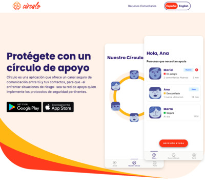
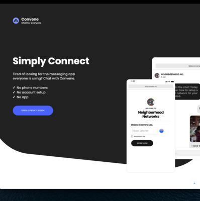
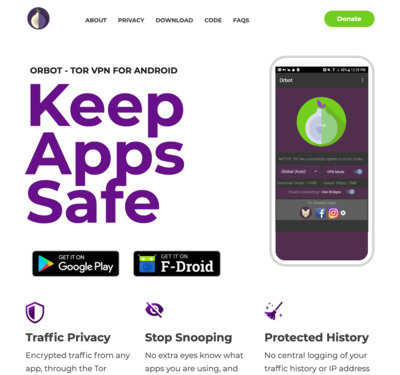
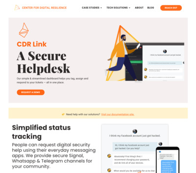
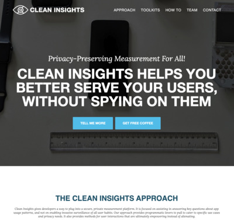

## **We are a global team who builds and designs [easy to use secure apps](apps), open-source [software libraries](code), and [customized solutions](contact) that can be used around the world by any person or organization looking to protect their communications and data from unjust intrusion, interception and monitoring.**

Whether you are an average person looking to affirm your rights or an activist, journalist or humanitarian organization looking to safeguard your work in this age of perilous global communication, [we can help](/contact) address the threats you face.

**See some of our recent and ongoing work below**

 <a href="https://encirculo.org">Círculo</a> helps you stay securely connected to a circle of support. Establish safety and check-in protocols, send alerts, share your location and keep those in your circle informed. We have worked extensively with <a href="https://www.article19.org/regional-office/mexico-and-central-america/">Article 19</a> on this project.

<a href="https://letsconvene.im">Convene</a> is a Matrix-based chat platform that supports secure and private communication and sharing. It was co-designed with human rights partners at <a href="https://rightsactionlab.org">Rights Action Lab</a>.

<a href="https://orbot.app">Orbot</a> is a Tor-Powered VPN for Android and iOS that keeps app traffic safe and unblocked. We have also contributed to <a href="https://onionbrowser.com">Onion Browser for iOS</a> and <a href="https://onionshare.org">Onion Share Mobile</a>, all through our 15+ year partnership with <a href="https://torproject.org">Tor Project</a>.

<a href="https://digiresilience.org/solutions/link/">CDR Link</a> is a secure helpdesk. We provide secure Signal, PGP, Whatsapp & Telegram channels for your community. Through our partnership with the <a href="https://digiresilience.org">Center for Digital Resilience</a>, Link has become the gold standard for secure and private help desk systems for human rights and humanitarian use cases.

[Clean Insights](https://cleaninsights.org) gives developers a way to plug into a secure, private measurement platform. It is focused on assisting in answering key questions about app usage patterns, and not on enabling invasive surveillance of all user habits. It has been adopted by leading privacy-focused companies, such as <a href="https://mailvelope.com">Mailvelope</a>.

