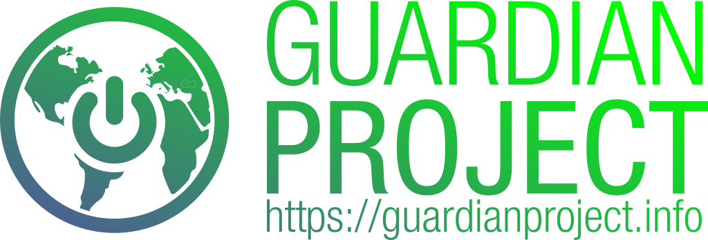
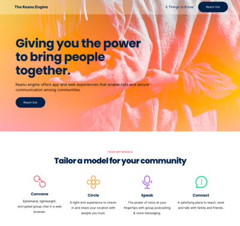
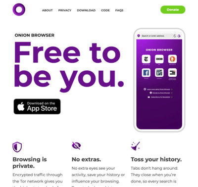
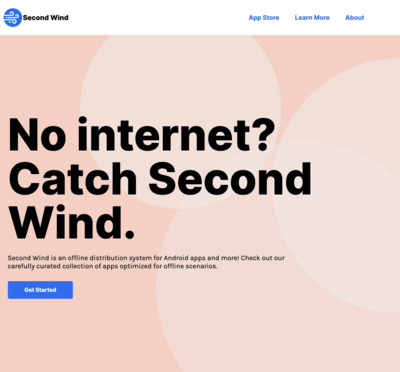

While smartphones have been heralded as the coming of the next generation of communication and collaboration, they are a step backwards when it comes to personal security, anonymity and privacy.

**Guardian Project** creates [easy to use secure apps](apps), open-source [software libraries](code), and [customized solutions](contact) that can be used around the world by any person looking to protect their communications and personal data from unjust intrusion, interception and monitoring.

Whether you are an average person looking to affirm your rights or an activist, journalist or humanitarian organization looking to safeguard your work in this age of perilous global communication, we can help address the threats you face.

**See some of our recent and ongoing work below**

<a href="https://cleaninsights.org">Clean Insights</a> gives developers a way to plug into a secure, private measurement platform. It is focused on assisting in answering key questions about app usage patterns, and not on enabling invasive surveillance of all user habits. Our approach provides programmatic levers to pull to cater to specific use cases and privacy needs. It also provides methods for user interactions that are ultimately empowering instead of alienating.

<a href="https://keanu.im">Keanu Engine</a> offers app and web experiences that enable safe and secure communication among communities.

Safety starts with community. <a href="https://encirculo.org">Círculo</a> helps connect you to a reliable network of six peers. Establish protocols, send alerts and keep those in your circle informed.

<a href="https://letsconvene.im">Convene</a> is a matrix-based chat platform that supports sharing of any kind. Rooms are private and encrypted by default.

<a href="https://onionbrowser.com">Onion Browser</a> is your trusted connection to Tor on iOS through a privacy-focused web browser.

<a href="https://orbot.app">Orbot</a> is a Tor-Powered VPN for Android that keeps app traffic safe and unblocked.

<a href="https://secondwind.guardianproject.info">Second Wind</a> is an offline content and apps distribution system for Android devices, powered by the F-Droid open app store project.

< href="https://digiresilience.org/solutions/link/">CDR Link</a> is a secure helpdesk. We provide secure Signal, PGP, Whatsapp & Telegram channels for your community.

