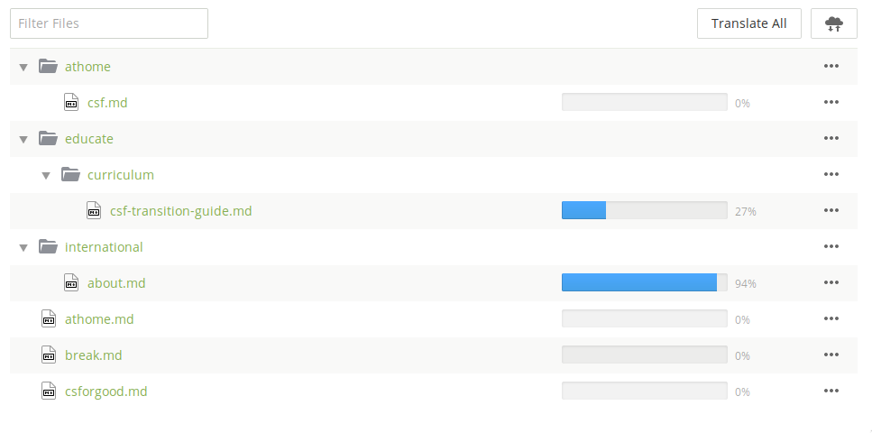
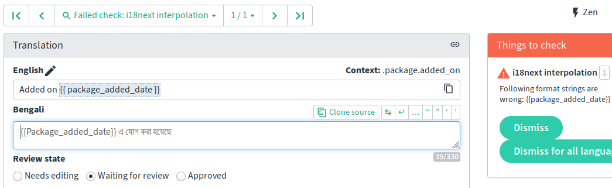

Crowdsourced translation platforms like [Weblate](https://weblate.org/), Transifex, Crowdin, etc. have proven to be a hugely productive way to actively translate apps and desktop software.  Long form texts like documentation and websites remain much more work to translate and keep translated.  Many translation services currently support Markdown and HTML, but very basically, which means much more work for translators and webmasters.  Translators can inadvertently break things, either with a typo or because of a lack of knowledge of a specific syntax.  This can make the whole page layout break.  Webmasters and documentation maintainers must carefully check the process to ensure everything is working smoothly.  With the spread of Markdown as a standard format, there is now hope!  Software developers can focus efforts on the Markdown translation workflow, and Markdown is more tolerant of syntax errors than HTML.

Guardian Project has been working for a decade on making localization and the long term maintenance of translation a lot easier for developers and translators.  We call this ongoing collaborative effort "Linguine" after a name chosen in a multi-project meeting.  One of the biggest usability barriers in the world of software and the internet is language.  Most of the world does not speak English, yet most of [the internet is written in English](https://www.bbc.com/future/article/20200414-the-many-lanuages-still-missing-from-the-internet).

[](https://en.wikipedia.org/wiki/Maya_script)


## The App Workflow

The developer of an Android or iOS app does not need to know much
about localization or translation in order to make their apps fully
translated.  Both supported translation from the
beginning as a native feature.  Software strings are already broken up into
small chunks, which fit nicely into crowdsourced translation software.  The progress bars and step-by-step user experiences map easily to these strings.  The string file formats also allow for all sorts of valuable [metadata](https://docs.weblate.org/en/latest/formats.html#xliff) the give translators context and guidance, as well as to enable automated checks.  The strings of an app also do not to be 100% translated to be useful.  For example, if all strings are translated except for those
in a new feature, most users will never even notice the missing
translations.  If only the most commonly seen strings are translated, that translation can still be useful since it will provide the user with enough to navigate all the features of the app.  Here are three examples of app strings for translation:

Android _strings.xml_:
```xml
<string name="app_details__no_versions__show_incompat_versions">To show incompatible versions here anyway, enable the \"%1$s\" setting.</string>
<string name="app_details__no_versions__no_compatible_signatures">No versions with compatible signature</string>
<string name="app_details__no_versions__none_compatible_with_device">No versions compatible with device</string>
```

Python _gettext .po_:
```gettext
#: ../fdroidserver/build.py
msgid "Don't create a source tarball, useful when testing a build"
msgstr "不创建源码 tarball 文件，便于内部版本测试"

#: ../fdroidserver/stats.py
msgid "Don't do anything logs-related"
msgstr "请勿做任何日志相关的操作"

#: ../fdroidserver/build.py
msgid "Don't refresh the repository, useful when testing a build with no internet connection"
msgstr "不刷新资源库，便于没有互联网时的内部版本测试"
```

_i18next_ JSON:
```json
{
    "package": {
        "anti_features": "Anti-Features",
        "added_on": "Added on {{ package_added_date }}",
        "signed_by_fdroid": "It is built and signed by F-Droid, and guaranteed to correspond to <a href=\"{{ source_code_url }}\">this source tarball</a>.",
        "suggest_downloading_via_fdroid": "Although APK downloads are available below to give you the choice, you should be aware that by installing that way you will not receive update notifications and it's a less secure way to download. We recommend that you install the F-Droid client and use that.",
    }
}
```


## Long Form Text

With documentation, blog posts, and other long form text, it is a very different story.  To start with, there are lots of debates of how best to break up a text: paragraphs, sentences, or whole pages?  Does each bullet point count as a paragraph or a sentence?  Do these rules work for both blog posts, which rarely change after publication, as well as documentation, which must be kept updated?  Also, measuring the translation "completeness" of a long text is harder.  If a blog post is 80% translated, it will be very disconcerting for readers when sections switch to English and back.  A documentation page that is 20% translated is not useful.

With websites, there is also more varied context than with software strings: paragraphs, titles, bullet points, code blocks, [YAML Front Matter](https://jekyllrb.com/docs/front-matter/), etc.  There is currently no way to add translation metadata directly to the Markdown or HTML document, so that context is often missing, or it must be manually entered in the translation platform.   One really nice property of Markdown is that the plain text version looks good, so if the writer messes up the markup syntax, all is not lost.  Translation software can be made to fully "understand" Markdown (e.g. the [AST](https://en.wikipedia.org/wiki/Abstract_Syntax_Tree)), and provide automated syntax checks.  Such an approach might totally fail if someone messes up the markup in the source document.  In that case, a more naive direct representation might work better.  Sites that run linters will want the AST approach, sites with non-technical writers might not.  In short: Crowdin, Transifex, and Weblate currently support Markdown, but in a limited way. And these limitations mean much more work for translators, developers, and webmasters.

If the translators are technically savvy and know the topic and syntaxes well, then the webmaster doesn't need to worry too much.  The translation platform will make it easier for the translators to keep the translations maintained.  Another key benefit of crowdsourced translation is that translators don't need as much technical skill to meaningfully contribute, as long as the project fits well into the translation workflow.  Due to the current complexity of websites and limitations of the tooling, there is still no single translation workflow for long form text that works well for the majority of websites and documentation.  That means it is important to know available workflows and understand which one fits best to your project.


## User Experience Breakdown

Website localization is also not nearly as standardized as apps.  With apps, a single translation workflow will work for basically all cases.  For websites, that is not possible since there are so many different kinds of texts and requirements.  For some documentation, it is acceptable to have 20% of the text slightly out of date in the translation.  For other documentation, each page needs to be 100% complete, otherwise the original English should be shown.  A good translation experience therefore requires customization.

The workflow will also vary based on the content and the skills that the translators have.  If it is deeply technical documentation, then the translators will be comfortable markup and code syntax since they must have technical knowledge in order to translate the materials.  The translators will prefer being closer to the source format.  If the content is blog posts from an organization advocating good governance, then the translators are mostly going to be non-technical, and the workflow should minimize exposure to technical details like [YAML Front Matter](https://jekyllrb.com/docs/front-matter/) blocks.

One large, complicated example is the [F-Droid](https://f-droid.org) website, which is built with Jekyll.  It has five different kinds of materials that need to be translated, each with its own distinct requirements: [chrome strings](https://hosted.weblate.org/projects/f-droid/website/), [pages](https://hosted.weblate.org/projects/f-droid/website-pages/), [docs](https://hosted.weblate.org/projects/f-droid/website-docs/), [blog posts](https://hosted.weblate.org/projects/f-droid/website-posts/), and [tutorials](https://hosted.weblate.org/projects/f-droid/website-tutorials/).  In order to group the strings by these requirements, the site uses _i18next_ JSON for use in Jekyll Liquid tags and custom [_po4a_](https://po4a.org/) sections to handle the Markdown and YAML Front Matter.  _po4a_ makes it possible to group the translation levels per-section, then add requirements: the entire "pages" section must be ~95% translated for inclusion, while "docs" and "blog posts" sections can be untranslated.  Each individual blog post must be completely translated to be published.  Each documentation page must be 90% translated to be published.  It is not 100% to allow for some time lag between when the original is updated, and the translated is updated.  Ideally, the source string edits could be marked as "typo correction" vs "update" to aid making better automatic decisions about which translations should still be published.


## Process and People

If there are people fully engaged in all parts of the translation process, then it is possible to tightly coordinate the updates to the source and the translations.  Other projects rely on crowdsourced translations because
it is easier for them to acquire volunteer contributions than increasing translation budgets.  So the advantages and disadvantages of various workflows have to be weighed:

* Delay publishing the source update until the translations are done.
* Translated pages are reverted to English unless they are 100% updated.
* Translated pages show outdated parts until they are updated.
* Translated pages show English parts until they are updated.

There are other trade-offs to consider in terms of the relationship between the translator and the project:

* Only trusted translators who can directly update the translations:
  * Rapid time to publish
  * Less work to translate
  * Much fewer languages supported
* Trusted reviewers with any contributions from any translator:
  * More language coverage, quality control from multiple eyeballs on every string
  * Asynchronous, unpredictable workflow
* Contributions from any translator:
  * Rapid maintenance updates and even more languages
  * More errors in translation, including potentially vandalous or malicious contributions
  * Skilled translators will be less interested in contributing

When it is possible to achieve 100% translation, like on a small site or when there is a budget to pay for all the documentation to be translated, then the workflow is a lot simpler.  That allows the tools to have a more direct user experience.  Volunteer-based, "best effort" translation is a different story.  Then it is important to clearly represent which strings and pages should be translated first, and which are non-essential.  Crowdin, for example, can show all the documents in a familiar looking file browser, with nice progress bars.  There is no indication of priority.  This is great if someone is paid to complete the full translation, but is much less clear for volunteers to jump in and contribute to the more important parts.


_Crowdin project file navigation_

Unfortunately, there is no shining example of a user experience that covers this second scenario well.  Weblate provides one good tool, where the strings are presented to the translator in order of the priority set in the metadata (e.g. like [XLIFF's _priority_](https://docs.oasis-open.org/xliff/v1.2/os/xliff-core.html#priority)).  The translator just needs to start translating the first strings Weblate presents.


_One hack to add priority to Markdown for Crowdin_


## Mass Changes versus Merge Conflicts

Sometimes you have to make a small change to some of the coding of the website.  The website has suddenly gotten a lot more popular, so you need to work on making the caching work a lot better to reduce the load.  That means changing all of file references to include a version or hash value.  Those links are also in the source strings that are fed to the translation system.  And each change to the source strings prompts all of the translators to update their translations.  Normally, this is exactly what should happen.  But in this scenario, the translation should not change since it is just the links that changed.  To handle this, the webmaster or developer needs to be able to do mass edits on the source and translation while having a way to tell the translation system to ignore this change.  This can easily cause merge conflicts if a translator is working at the same time.

If these small changes only happen in source, the translations will be marked as needing an update.  Some platforms try to be smart about detecting changes, and will even mark strings as changed if both the source and translation were updated together.  That produces another scenario: The website fully translated into Tibetan, but now the translator has disappeared.  So those trivial changes are bumping more and more strings out of the translation, and soon it will be death by a thousand paper cuts and the Tibetan translation gets kicked out even though the underlying text is current.  It is just the inline code updates that are marking things as out of date.


## Automation and Checks

One essential part of any translation workflow is automated checks to make sure that the syntax has not been broken in the translation process.  Translation platforms must provide clear errors to the translators, otherwise all of these problems will be pushed to the webmaster or developer who imports new translations.  Or worse, they are overlooked and cause crashes or break layouts.  Good metadata is a key piece of that process.  For example, _i18next_ `{{ interpolation }}` is not the same as Python `{format_strings}`, though they look quite similar.  The metadata should include the file type and any relevant syntaxes.  Most developers are not aware of all of the details of the translation process, so these checks should be enabled automatically, as much as possible.  Manually enabling checks can be very hard to understand, since you have to understand both the developer's and translators points of view. These checks really pay off, like when technical contributors can go straight to strings with failing checks and fix the syntax problems, without any knowledge of the languages involved.  This is in contrast to a project's Continuous Integration (CI) tests, which generally only the software's maintainers follow. The barrier to entry for fixing failing checks is much lower since they are standardized across every project on the translation platform.


_Weblate highlights failing checks, the error counts are clickable to edit them all._


_Reviewing a single failing check in Weblate._

Context is very important for translators, and a good translating experience will provide as much useful context as possible.  That said, it cannot replace the real thing.  Having a automatic staging website will help catch errors before publication.  It also gives translators the feeling that they are building something real, when they are working their way up to being accepted for final publication.  [Tails](https://staging.tails.boum.org/) and [F-Droid](https://staging.f-droid.org) both provide complete staging websites that include all of the the languages, not only the complete ones.  Static site generators like Hugo and Jekyll let more technically skilled contributors rapidly build a local copy, and services like GitLab Pages and GitHub Pages can host a staging website [for](https://eighthave.gitlab.io/fdroid-website/) [each](https://bubu.gitlab.io/fdroid-website/) [fork](https://uniqx.gitlab.io/fdroid-website/).


## Translation Setup with _po4a_

[_po4a_](https://po4a.org) is a tool for customizing the representation of text in the translation workflow.  It is quite powerful, but also not simple to get started.  Each translation platform has its own documentation for directly using Markdown, so follow those docs for a simpler setup.  There is a lot to be said for having the translation platform directly handle the files that are being translated, without an intermediate localization format like XLIFF, _gettext_ PO, or JSON.  Sometimes other requirements mean that using _po4a_ in the middle will save a lot of effort, like the F-Droid example above.

The _po4a_ approach does work quite differently: the translations are stored in the _.po_ files rather than Markdown documents. This feels a bit unnatural at first, as compared to the regular workflow of a static site generator.  Translated pages are then converted from _.po_ to _.md_ just for building the site.  It gives a lot in return, especially for crowdsourced translation with specific requirements.  For example, it makes publishing and unpublishing translated documents happen automatically, based on the pre-configured specifications, like whether it is 100% translated.

po4a gives fine grained control over how documents are grouped, and what percentage must be translated before the translated version is published.  The direct version means each document is represented by a single translation component.  Many websites are organized into three common buckets, folders of Markdown documents should count as a single translation component:

* The base pages like "about", "contact, etc.
* Documentation
* Blog posts


### Projects using _po4a_

* Debian is using _po4a_ to [translate the _man_ pages](https://salsa.debian.org/manpages-l10n-team).
* The extensive [Tails documentation](https://tails.boum.org/contribute/build/website/) uses _po4a_ to make Markdown pages translatable in [ikiwiki](https://ikiwiki.info/plugins/po/).
* The Fedora project is using _po4a_ to translate the [documentation](https://pagure.io/fedora-docs/docs-fp-o) in [their own Weblate instance](https://translate.fedoraproject.org/)
* [Stellarium Astronomy](https://stellarium.org/) uses _po4a_ to [translate](https://github.com/Stellarium/stellarium/pull/908) "sky culture descriptions".


#### Coming Soon:
* https://reproducible-builds.org/ (built with Jekyll): https://salsa.debian.org/reproducible-builds/reproducible-website/-/merge_requests/56
* https://reuse.software (built with Hugo): https://github.com/fsfe/reuse-website/issues/26


