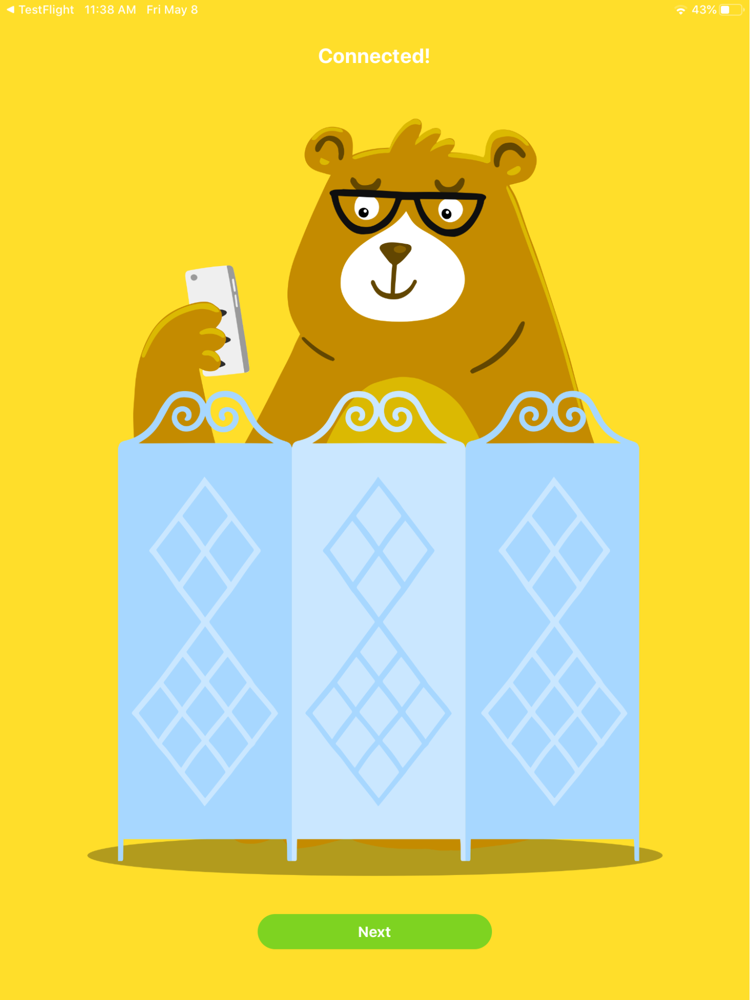
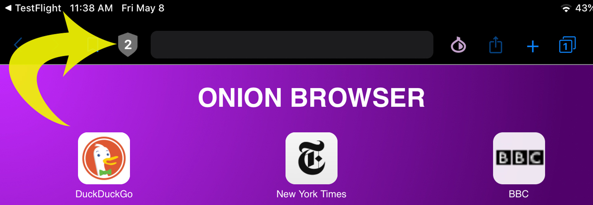
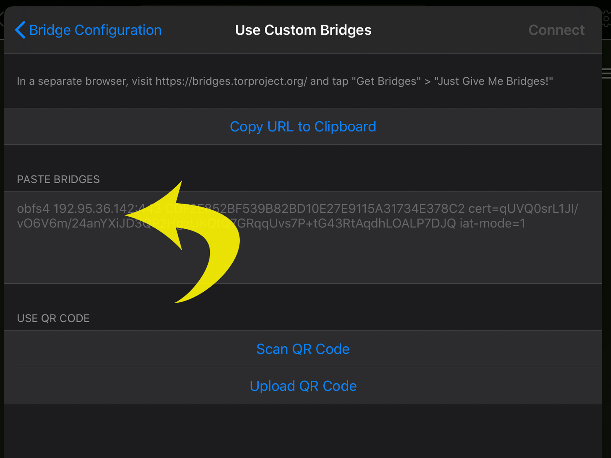
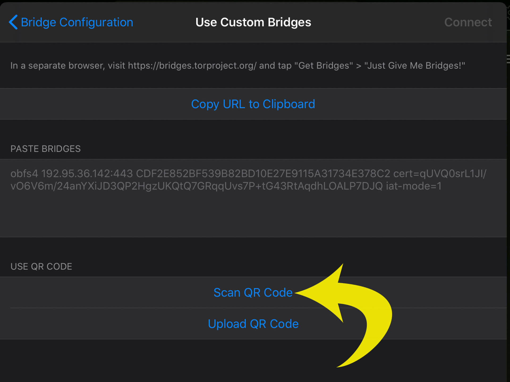
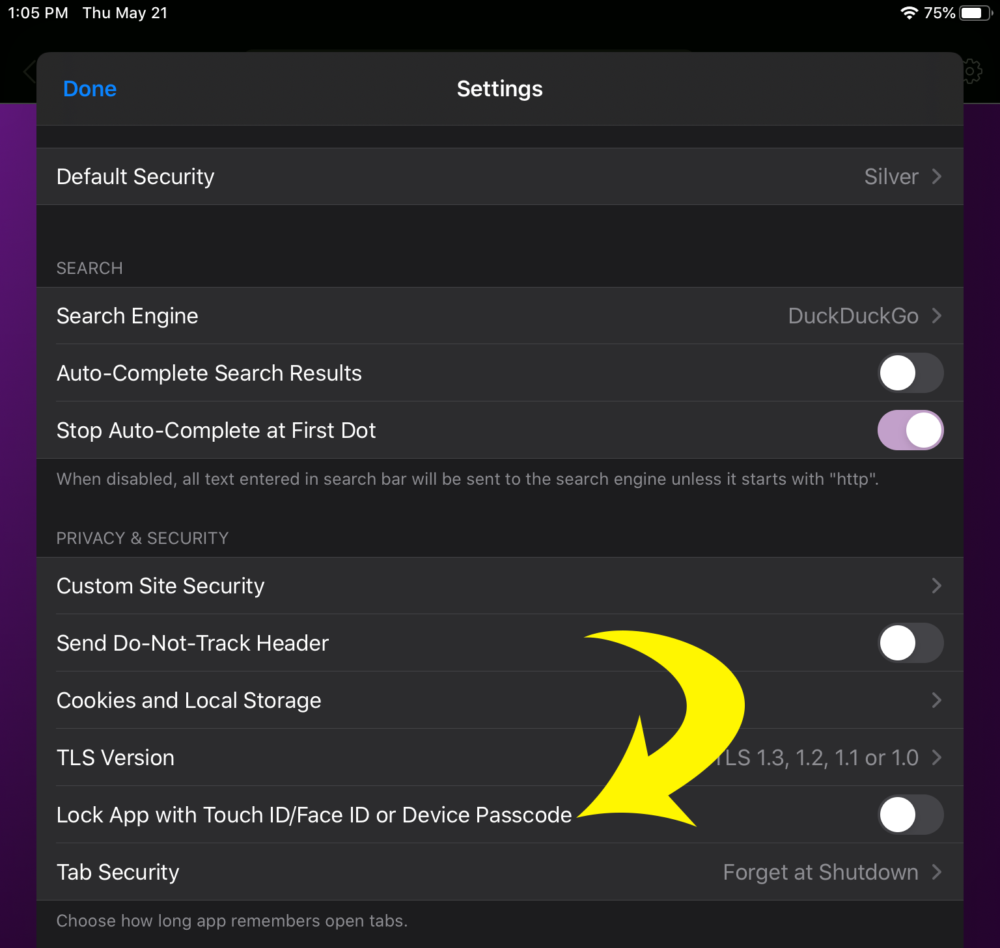
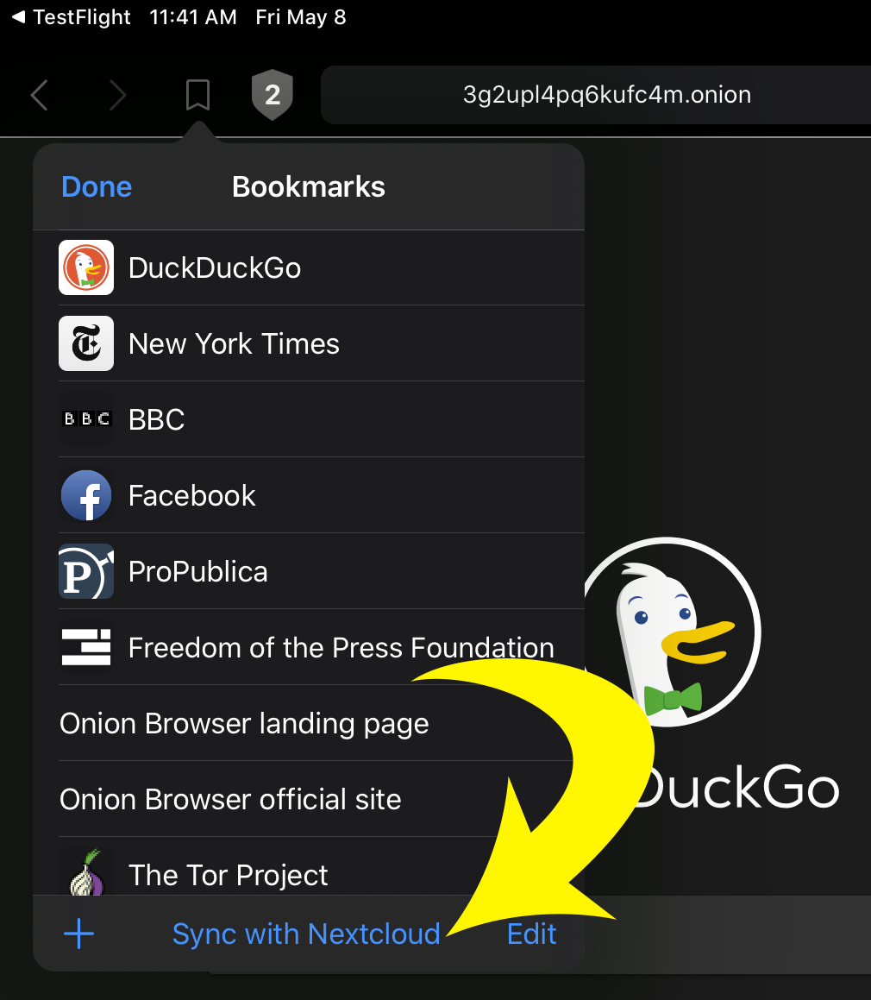

In this tutorial we're going to talk about the best practices to browse the web securely on iOS using [Onion Browser](https://onionbrowser.com) Release 2.6 and the [Tor network](https://torproject.org). [Onion Browser for iOS](https://onionbrowser.com) is a free, open-source web browser app developed originally by [Mike Tigas](https://mike.tig.as/), with Release 2.6 as a collaboration with the Guardian Project. Onion Browser has Tor built-in and uses Tor to protect your web activity.

You can also watch the [Onion Browser Video Tutorial](https://www.youtube.com/playlist?list=PL4-CVUWabKWeHeBpadBLjzlWVa7binXpj) on YouTube.

<!--  -->

	

## Who is this Tutorial designed for?

A few questions for you:

- Is your internet content being blocked?
- Are you concerned about your privacy while browsing the web?
- Do you want to protect your data from aggressive advertisers?

If any of these are true, this tutorial is for you!

## Don't have an iOS device?

<!--  -->

	

[Try Orbot](https://guardianproject.info/apps/orbot), the Tor connection for Android devices developed by the Guardian Project. Orbot allows you to route the apps on your phone through Tor.

<!--  -->

	

You may also try the [Tor Browser for Android](https://torproject.org), the official Tor browser for Android developed by the Tor Project team.

## First, what exactly is the Tor network?

<!--  -->

	

The Tor network is a collection of servers, run by volunteers, that allows users to improve their privacy and security on the Internet. Tor's users employ this network by connecting to their favorite services through a series of virtual tunnels rather than making a direct connection, thus allowing both organizations and individuals to share information over public networks without compromising their privacy.

Here's how Tor works: When you connect to the internet using Tor, a circuit is created. A circuit is a group of 3 different Tor relays located in different parts of the world that work together with encryption to obfuscate your connection to websites and web services, making it hard for third parties to trace the activity back to you.

<!--  -->

	

## Onion Browser, with Tor, is an important application for iOS users

Why? Because when you use Onion Browser

- All your browsing is private, since your traffic is encrypted through the Tor network
- No one can see your activities, save your history, or influence your browsing
- And there is no trace left behind since tabs don't hang around. They close when you're done, so every search is new

## How is the Onion Browser different from other browsers for iOS?

Security and privacy require some compromises, and you should be aware that there are some limitations when using the Onion Browser:

- Apple requires all web browser apps to use the same core web rendering engine. Due to this limitation, we are unable to compile and include our own web engine, based on Firefox Gecko, as with Tor Browser for desktop and Android
- Onion Browser only tunnels traffic within the Onion Browser app. If you are using a smartphone be aware that information outside of Onion Browser is not protected
- Sometimes your bandwidth speeds will be reduced, depending on the relays you are connecting to
- Websites that flag Tor as suspicious will show a CAPTCHA loop and you won't be able to access them
- Certain features of many websites may be disabled or work poorly on Onion Browser, especially at the higher security levels

## Onboarding

After [downloading Onion Browser from the App Store](https://apps.apple.com/us/app/onion-browser/id519296448), we'll give you a smooth start to using the app. After the initial loading screen, you'll be invited to connect to Tor before you start browsing. Be advised: Onion Browser always needs to connect to Tor before you browse. There's no operational mode that doesn't use Tor.

<!--  --> <!--  -->

	
		

There are two options here: connecting directly to Tor, as most users do, or connecting via a special "bridge". This latter option requires configuration, and we'll discuss it in a separate section of this tutorial. Select "Connect to Tor" and the app will let you know when it is ready.

<!--  -->

	

Click on " Next" to set up your security level.

<!--  -->

	

There are three levels of security you can select, according to your needs. For many users, Level 2 is the best choice to start. Click on "Learn More" to see more details about each option. Tap "Start Browsing" to begin using Onion Browser.

## The Onion Browser Home Page

On the home page of Onion Browser you'll see a couple of website suggestions, as well as more information about the app. We'd welcome your support for our work. Use the Donate Link to see the ways you can contribute with a donation. You can also subscribe to the Tor Newsletter to get updates about security and privacy on the Internet from the Tor team.

<!--  -->

	

On the home page, in the top navigation bar, you'll see there are two icons you don't find in other browsers, a Shield on the top left side and an Onion on the top right side.

<!--  --> <!--  -->

	
	

We'll discuss these in a bit. The Onion Browser also includes features you'll recognize like Bookmarks, Share, New Tab, Switch Tabs, and Accessing Settings. These are common in other browsers and work in the same manner here.

## Visiting websites

When you visit websites, Onion Browser will give you additional information about the security and nature of your connection.

- HTTPS websites will show a green lock on the right side of the URL bar, tap on it to verify the Certificate Information. 

<!--  -->

	

- Tap on the Shield icon to see your current security level 

<!--  -->

	

- Tap on the Onion icon to see the Tor circuit you are using, sometimes your current circuit will be too slow or it will not work properly, for those cases use the "New Circuit" button and you will be automatically connected to a new one. 

<!--  -->

	

On this drop-down menu, you will also find the option to connect to Tor using bridges. Please remember that you should always try to connect to Tor without using bridges and only use them if that fails. We'll talk more about bridges later.

- The Share icon allows you to send a link to the website you are looking at using other apps in your device. It also allows you to open the link using Safari if the site is not opening properly using Tor. This will be out of the Tor network and is not safe 

<!--  -->

	

- The same applies to open images and links with Safari. But you can also open links safely on a new tab, and navigate them the same way you will do it on any other browser

<!--  -->

	

- If your screen times out or you send the browser to the background all your current tabs will disappear when you return to your browser, this is a security feature that can be changed in your settings

- Downloading content is easiest with the Share icon. Display your content (such as a PDF-formatted article) in a tab, then tap the Share icon. Select 'Save to Files', then on the next screen, choose the desired locations ("Downloads" folder is shown here). Tap 'Save' and the content will be saved in the Downloads folder for later use or further sharing.

<!--  --> <!--  -->

	
		

## Security & Connectivity

### Bridges

There's a special way to connect to the Tor network, designed for users in the most restrictive geographies or users personally at risk of invasive monitoring. Bridges are like special on-ramps for Tor that are more aggressive about defeating monitoring. That comes at a cost in performance, though. We like to reserve these pathways for most impacted users, so please use them sparingly.

If you know bad actors are monitoring Tor usage in your geography, you'll want to configure a bridge immediately when you first open Onion Browser. You can do that right from the first onboarding screen, before connecting to Tor

<!--  -->

	

Whether you configure your bridge immediately or after you've been using Onion Browser for a while, you need to be careful how you get your bridge information. You have several options. See the Bridge Configuration settings (accessed during on-boarding as above or by tapping on the Onion icon when viewing a website and then tapping 'Bridge Configuration').

<!--  -->

	

Your first option should be the list of bridges using the so-called Obfs4 technology, a list already built into Onion Browser. Select the "Built-in Obfs4" option and Onion Browser will instruct Tor to use that selection of bridges as it attempts to connect. Tap "connect".

Unfortunately the bridges on that list can become crowded and connection may fail here, too. If you know a trustworthy person who uses a bridge to connect to Tor, your second option is to have your friend help you by sending you a bridge QRCode your device can scan and automatically configure to use that bridge. Or, less securely, you can copy/paste a bridge identifier that your friend sends you via another service (messaging, for example). To use this option, tap "Custom Bridges", and then either scan the provided QRCode or paste your provided bridge into the text area shown, then tap "Connect".

<!--  --> <!--  -->

	
		

If these options fail, you can get access to a fresh selection of Obfs4 bridges using the service called MOAT to get up-to-date information in real-time. This option works in a way that does not expose itself to suspicion. To use this option, select "Built-in Meek/Azure" and tap "connect".

Last, the Tor Project itself also maintains a list of bridges. For this option, tap 'Custom Bridges', then 'Request Bridges from torproject.org' and follow the instructions there. You'll get a bridge identifier, and you'll paste it into the text area, same as you would if a friend provided it to you. After pasting, tap "connect". Note that this method of contacting the Tor Project to get a bridge identifier is an action that itself might be blocked.

Again, we want to steer you away from using bridges. The degradation of the user experience can be extreme and please remember that there are people who actually require this capability to get any connection at all. As capacity is limited, we want to give those people the first opportunity.

### BioMetric Authentication

You can place a second level of access security on Onion Browser by using its authentication option. You might prefer this option if you believe you face a physical security threat, if there is a chance your device might get stolen or if your device might be otherwise misused by people you don't trust.

First, you need to set up your iOS device to require security at login via a 6-digit numeric Passcode, FaceID or TouchID. Use the iOS Settings app. Select and configure the method you prefer. If you've already done that, there's no need to change. Be aware that all manipulations of our authentication settings here will require you to enter your password.

<!--  -->

	

Now tap the Onion Browser settings icon to get to the Settings page. You'll see a selection option for **"Lock App with TouchID/FaceID or Device Passcode"**. Select that option to enable it and restart Onion Browser. On your next use, Onion Browser will require your ID (in whatever form you've requested) before it will start up.

## Useful Tips

### Dark Mode

The Onion Browser has a built-in Dark Mode that allows it to comply with the system setting for the "dark" color scheme. To set Dark Mode, visit the iOS Settings application and tap Display &amp; Brightness. Select your appearance here and Onion Browser will comply with this setting.

<!--  -->

	

### Tab Security - Hide Web Pages When Switching Apps

Hiding web pages when switching apps is a feature required by people who are in danger of having their device removed from their person by other bad actors. If that happens, the contents of their open tabs can be seen and perhaps screen-shotted by those bad actors and used in prosecution. While hiding web pages sounds great at first, it means you lose your browsing "state" when switching back to Onion Browser later. Frankly, it is terribly inconvenient for most users. So, there are lesser options, too. From the Onion Browser Settings page, tap "Tab Security"

<!--  -->

	

Then select from:

#### Forget in Background

Happens when you tap the HOME button, otherwise switch apps, or the display times-out and the login screen is presented.

#### Forget at Shutdown

Happens only when user actually closes the app or shuts down the device

#### Remember Tabs

Tabs are NOT hidden; this setting is also called "Startup in last state" and it's the opposite of "remove web pages when switching apps" because it means your browsing state is saved between sessions. For many, this is a tremendous time-saver, but users concerned about their device being taken from them should not enable this feature.

_NOTE: Your bookmarks are also an indication of your browsing interests. Creating many bookmarks on the device leaves a certain "fingerprint" about your browsing intentions in the same way open tabs indicate what's actually being used. See the_ Nextcloud Bookmarks _feature as a way to resolve this problem._

### Onion Browser As Your Default System Browser

There are a lot of ways you can acquire a link to web content and resources. Many applications, when seeing a link, will offer the option to open that link in the web browser. On iOS, Safari is the system browser, registered to open links, and iOS doesn't usually allow other browsers to have that privilege. Safari doesn't use Tor, so it's not safe to open links that way. We can't make Onion Browser the "system browser", but there is a way to disable Safari and allow Onion Browser to open your links. Follow these steps:

Open the iOS Settings app. Tap "Screen Time" (if it's your first time using this feature, several help screens will follow).

<!--  -->

	

Tap "Content &amp; Privacy Restrictions" to enable it. Tap "Allowed Apps". Tap "Safari" to disable it. This way, Safari won't be opened when links are clicked in any app starting with http:// or https://. OnionBrowser can now open the links safely.

### NextCloud Bookmarks

Bookmarks make it easy to access frequently-desired content as well as to preserve access to infrequently-visited, but necessary, sites. However, bookmarks can also represent intent or interest and, for those in danger of losing their device to bad actors, this can be an issue.

If you use NextCloud, you can manage your Onion Browser bookmarks on your other devices and synchronize them with Onion Browser. Here's how:

<!--  --> <!--  -->

	
		

Tap the Bookmarks icon, then tap 'Sync with Nextcloud'.Enter the link for your Nextcloud server along with your username and password, then tap 'Sync Bookmarks'.

If you're not a Nextcloud user and this sounds interesting, find more about NextCloud at nextcloud.com.

## Some Failure Modes and How to Recover

Let's talk about ways in which Onion Browser - and the mountain of software and Internet network architecture behind it - can let you down. Yes, it DOES happen. Sometimes your network just doesn't have the performance and responsiveness it requires. Sometimes your network is under heavy surveillance. Sometimes the Tor network is under direct attack by bad actors. Let's look at a few of the failures you might experience and see what you can do to mitigate at least some of the impacts. We regret that this list is not complete.

### On Start-up

What if I have no network connection of any kind and I don't realize it? What if my network connection is very slow? What if Tor is blocked in my country?

First, if you know - via friends or trusted information sources - that Tor is blocked in your country, you'll need configure access via a bridge on your very first startup. Please revisit the prior discussion on how to properly configure Tor bridge access. Please remember, bridges tend to degrade the user experience in a number of ways. They're a "last resort".

If you're not connected to a local or wide-area network (and don't realize it) or if your connection is very poor (low-bandwidth), or if Tor is blocked in your country, Onion Browser won't be able to start. Unfortunately, there's no safe way to automatically distinguish between these different conditions. First, try to verify that the device itself has a connection or move to another location &amp; network. Please remember, Tor can be slow to start up - especially on your first use - even under the best circumstances because it has to discover its network of nodes (at least partly) before it can build circuits. This does take a little patience.

### On Restart

What if Tor fails to start or restart properly within Onion Browser (can this happen, for example, when switching tabs)?

If Tor fails on start/restart, Onion Browser assumes that it's because the Tor nodes available from your location are blocked. Onion Browser will urge you to configure bridges. You won't be able to proceed, though. You actually need to stop Onion Browser (switch to another app, or kill the app by swiping it out of iOS' app-cards overview) and then start it again.

If you experience a lot of this type of failure, you may want to consider the Onion Browser setting that allows you to "Remember Tabs" (also called "start up in last state"). That's available using "Settings -> Tab Security -> Remember Tabs".

### After A Heavy-Use Session

There's a lot going on within Onion Browser and sometimes after a lot of use (or maybe due to a lot of tabs open for a long time) Onion Browser will run out of working memory on the device. In this case, iOS will probably kill the app by itself (though you may have to swipe it away from the app-cards overview under certain circumstances). When you start it again, it will be a fresh start.

This is another good time to remember, if your situation allows it, use the "Remember Tabs" feature.

### Failures Under Regular Use

You may experience using Onion Browser in a normal way, seemingly fine, and then when tapping a link or visiting a new site nothing seems to happen. It's hard to know if the link or site is the problem, or if Onion Browser or Tor is the problem.

You can check if Tor is still running by creating a new tab and visiting, for example, DuckDuckGo.com. If Tor really has failed, you should leave the app and enter back after a few seconds (that is, switch to another app, then return). That action should restart Tor. If that fails to help, go to iOS' app-cards overview, swipe-away Onion Browser and start it again.

If the new tab opening to DuckDuckGo.com does work, then Tor is still operating and that's a good indicator that the link or website you visited contains some JavaScript Onion Browser thinks is unsafe.

Onion Browser has a pop-up and ad blocker integrated. These, unfortunately, might interfere with the web page in a way that makes it break. These features cannot be switched off, currently.

Lastly, failure can happen when the Security Level currently set for the page is denying the website from taking certain actions. Loading media is one such action, though not every time. If you're sure leaking your browsing information to somebody listening on your connection isn't a problem, you might want to lower the security level to "Bronze", at least for that site.

### What Are These "Circuits" You Talk About?

The circuit is the path your communications take through the Tor network (whose nodes exist in many countries in the world). Normally, you don't need to take specific care regarding the circuit, because that's Tor's business. However, depending on the "exit node" Tor has chosen, you might see a website localized wrongly or a website that mistakes you for a hostile due to your country-of-origin (which Tor has set). In those cases you can request a new circuit. It's easy, right there on the circuit display.

<!--  -->

	

The circuit display could also hint to the reason of a slow connection. If you're routed around the world, that might be the problem. However, Tor typically tries to avoid these situations automatically and chooses circuits with hops near you.

### Custom Site Settings

Now that we've introduced "Security Levels" in the new Onion Browser, there's much less need to store custom settings for individual websites. That's a good thing because these settings are hard to remember once customized. For example, did you remove all restrictions from a website because you were once on a less restricted network? Well, when you're back on your surveilled network, it's hard to remember that you customized just that one site. That can lead to an unplanned exposure.

We hope you like the new "Security Levels" mechanism - it's much easier to monitor how much risk you're exposed to using this mechanism. Enjoy it!

## Support

Work on Onion Browser during 2019 and through mid-2020 was funded by the [Open Technology Fund](https://www.opentech.fund/) and sponsored by the [Guardian Project](https://guardianproject.info/). [Mike Tigas](https://github.com/mtigas) was development architect, [Benjamin Erhart](https://github.com/tladesignz) was lead developer. [OkThanks](https://okthanks.com/) provided user-centered design services.

To contribute to the long-term maintenance of Onion Browser, please visit the [donation page](https://onionbrowser.com/donate).
