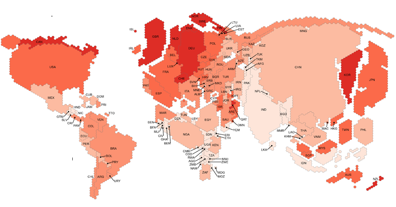
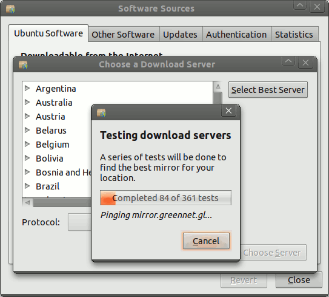

There are many ways to get the apps and media, even when the Internet is expensive, slow, blocked, or even completely unavailable.  Censorshop circumvention tools from ShadowSocks to Pluggable Transports can evade blocks.  Sneakernets and [nearby connections](https://briarproject.org/how-it-works/) work without any network connection.   Hosting on Content Delivery Networks (CDNs) can make hosting drastically cheaper and faster.  One method that is often overlooked these days is repository mirrors.  Distribution setups that support mirrors give users the flexibility to find a huge array of solutions for problems when things are not just working.  Mirrors on local networks can be much cheaper. Mirrors in specific countries are often not blocked or filtered.  Mirrors can be copied onto portable storage and moved to where the users are.

Repository mirrors are mostly associated with free software distribution.  Every major GNU/Linux distro, from [Debian](https://www.debian.org/mirror/list) to Red Hat, is available via mirrors.  Software collections like Android/Java's [Maven Central](https://maven.apache.org/guides/mini/guide-mirror-settings.html) and Python's [PyPI](https://pip.pypa.io/en/stable/reference/pip_install/#install-index-url) support mirrors as well.  [F-Droid](https://f-droid.org/docs/Running_a_Mirror/)'s infrastructure is also based on mirrors.  Free software repositories have proven so valuable, that there generally are mirrors maintained around the world.  Local mirrors of popular free software repositories are available in all continents, and most countries.

Mirrors also add conceptual complexity to distribution. Users who are used to internet services that work without configuration, could easily find discussion of mirrors confusing.  Mirrors also mean that more pieces of infrastructure need to be maintained.  When systems with mirrors are well organized, then this work can be broken into small chunks and widely shared, often even by volunteers, so that the overall system is resilient and maintainable even given limited resources.

## Building a repository mirror system

Good mirroring support must disconnect how the data is downloaded from how the data integrity is maintained.  That means data can come from anywhere, and still be properly verified before installing it.  This is usually done with an index of files signed by public key cryptography.  A system built on HTTPS and trusted servers is a bad candidate for mirroring.  This separation of concerns is a key property of distribution systems that allows them to be flexible while still providing fully verified distribution.

Then, it must be easy for users to configure the mirrors in use.  That means that mirrors first and foremost, should work without the user doing anything.  To ensure flexibility, they must be easy to add and remove, and new mirrors must be easy to find.  Both end users and repository operators should be able to specify mirrors to be used.  Legal requirements must also be heeded: the whole system should not require any service that might be legally questionable in any relevant jurisdiction.  EU users need GDPR-compliant services.  If the aim is to distribute in China, then the system cannot require Google Cloud Services.  Instead, it should also be able to go through cloud services available in China.

Mirrors are like all internet services in that there are always potential [privacy leaks]().  To protect users' privacy, it is important to be conscious of the potential metadata that is visible in the system, and who can get that data.  For example, transport encryption (TLS, HTTPS, etc) should be used even though the signed index provides strong integrity checks in order to reduce metadata leaks.  Even with transport encryption, the oeprators of the mirrors themselves will still see the metadata.  When there are individual files that users can download, the mirror operators could see which user is downloading which file.  Metadata like the description of a movie file or the icon of an app will give away the user's interests.  When possible, this metadata should be grouped to reduce the detail in the metadata.  Icons can be downloaded in random groups of 10.  Text descriptions can be grouped by language or other more neutral grouping.

## Example: F-Droid

F-Droid repositories are collections of packages, mostly Android APK app files, which are organized in a single folder that includes an signed index file which lists the entire contents.  This includes descriptive texts, available graphics, etc.  This file structure is not tied to any particular transport method as long as the _repo/_ folder and index files remain intact.  The client keeps the public key of the index signature locally, and uses that to verify the index file.  The index also includes a list of URLs pointing to official mirrors.  By default, repositories are served over HTTPS, but nothing in the repository structure requires that.  This allows F-Droid to use repositories from SD Cards and USB OTG thumb drives using `file:///` URLs.  A mirror is then simply defined:  a mirror is any available copy of a repository.  The mirror need not even be a complete copy, as long as the index and desired packages are present.

F-Droid automatically handles much of the process of using the mirrors.  Each F-Droid repository (aka "repo") can include a list of official mirrors in the index.  The F-Droid Android client will automatically use all of the official mirrors, randomly switching between them for downloads.  The mirrors are still completely configurable.  Anyone can create their own mirror, either via the `fdroid mirror` command for any repo, or [via _rsync_](https://f-droid.org/docs/Running_a_Mirror/) for _f-droid.org_.  And F-Droid user can then ["subscribe"](https://f-droid.org/tutorials/add-repo/) to any mirror via the mirror URL.  Users can also disable any mirror from the repo's details screen.


 


[Extensive]() [work](https://f-droid.org/docs/Security_Model/) has gone into making F-Droid the most private "app store" for mobile devices, including minimizing the potential metadata leaks.  There is a single index file for all the packages, and it includes all the translations.  So all users fetch the exact same index file, so the _f-droid.org_ and mirror servers cannot infer from the index which language the device is using.  The app icons and screenshsots are downloaded on demand, so that is one metadata leak.  F-Droid requires either HTTPS or Tor Onion Service transport encryption to minimize such leaks.

On the idea of distribution resilience, I added more entry points to our fdroid repo:  https://guardianproject.info/fdroid/

I found a new, free, easy cloudflare-based mirror option for non-Tor connections: glcdn.rawgit.org.  I don't get who funds it, but it is free and zeroconf if you have a gitlab/github repo
since our fdroid repo is mirrored to github and gitlab repos
so that gives us: Mayfirst, Tor onion, Amazon S3, github.com, gitlab.com (Google Cloud), RawGit/Cloudflare

* public Chinese mirrors mean faster, more reliable, and perhaps cheaper access to f-droid.org

* several mirrors also provide rsync access, making it easy

* turns out that lots of different kinds of relibility problems look quite similar from the point of view of the F-Droid client app.
  * outages
  * network troubles
  * network blocks

* nearby swap has gotten some reliability improvements

# TODO screenshot of USB-OTG

* CDNs have made distributing static files so cheap, there are many services that will distribute your files without charging you for the service.
* https://gitlab.com/fdroid/fdroidserver/-/issues/348

ASL19's Toosheh service would be perfect for something like the Wind Repo: they already have a whole technique for broadcasting big chunks of data via satellite TV, and an app to decode that data to a USB OTG https://knapsackforhope.org/

## Example: Ubuntu

Ubuntu uses a system of mixed mirrors and CDNs [based on standardized domain names](https://wiki.ubuntu.com/Mirrors#Country_mirror_requirements), which includes some level of [automatic setup](https://wiki.ubuntu.com/DynamicMirrorDecisions) based on measurement.  The domain name is `COUNTRYCODE.archive.ubuntu.com`.  During install, the user chooses the country to set up the device accordingly.  The mirror is then set to use the mirror domain name based on that country, e.g. a device set to Uganda would use `ug.archive.ubuntu.com`.  When a country-specific mirrors exists, that domain name points to it.  Ubuntu has over 50 in-country mirrors. Otherwise, any other `*.archive.ubuntu.com` domain name points to a mirror running on a major CDN.  This setup allows Ubuntu to change the mirror server-side setup separately from the user's selection on their device.  Additionally, users are then still free to edit the configuration and use any URL that they want, including pointing to local media like CDROMs and thumb drives.  And anyone can [create their own mirror](https://wiki.ubuntu.com/Mirrors) without first getting permission.

