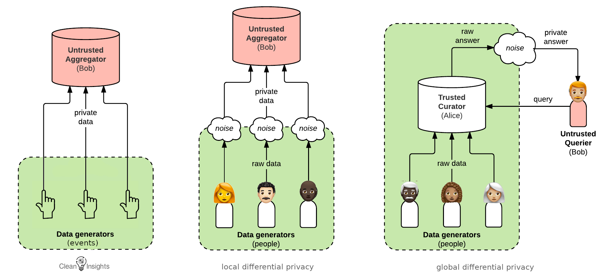

There is a giant problem with the "collect it all" status quo that pervades on the Internet, this has been clear for a long time.  Tracking people has become so [widespread](https://www.ghostery.com/study/) that [organizations](https://noyb.eu), [communities](https://f-droid.org), [projects](https://exodus-privacy.eu.org) and [university](https://privacylab.yale.edu/) [labs](https://privacylab.at) have sprung up dedicated to detecting and publicizing their presence.  Data and analytics are clearly useful for software creators and funders, but they also easily lead to harming people's privacy and well-being.  The past year of work on Clean Insights has clarified our goals to make analytics possible without injuring the very people we aim to serve.  Clean Insights takes the world of data analytics and turns it on its head.   The Clean Insights approach starts with thinking about the data, then choosing only the data that is clearly safe to use.  A user's location, complete device description, or other identifying information is dangerous to gather.  A simple count of how many times a feature was used, or a webpage was visited, can be gathered without links to people.

There are some widely known efforts for preserving privacy when doing analytics.  The most famous is perhaps "[differential privacy](https://en.wikipedia.org/wiki/Differential_privacy)", which is used by the US Census Bureau and Apple.  This approach has certain assumptions:

* Personally Identifiable Information (PII) is collected and stored.
* A legal compliance team reviews the legal ramifications of storing PII.
* A security team defends the stored data.
* Administrative staff handles compliance with data regulations.
* A PR team to do outreach when PII is leaked or spilled.

These assumptions are only possible for large, well-funded organizations to fulfill.  Apple already has extensive staff around the world to handle all this.  A dissident newspaper from a small country does not.  Metrics are nonetheless valuable for this dissident newspaper, and for so many other small- and medium-sized organizations.  So Clean Insights starts with different core assumptions that are much more broadly applicable:

* As little data as possible is stored to reduce the security and leakage risks.
* The stored data does not reveal identities if made public.
* Legal review is reduced as much as possible.
* No expensive computing resources required.

## Starting out with Clean Insights

In order to make the Clean Insights approach work, it must start with [thinking about the data](https://gitlab.com/cleaninsights/clean-insights-design/-/blob/master/docs/Clean%20Insights%20-%20%20Feb%202020.pdf).  When setting up metrics and analytics, there is a natural temptation to want to have all the information.  We recommend starting with a very small set of safe measurements as a way to avoid temptation, which might lead the project into hazardous ground.  For web server logs, start by eliminating the PII at the source: use a privacy log configuration for [Apache](https://guardianproject.info/2017/06/08/tracking-usage-without-tracking-people/) or [NGINX](https://f-droid.org/2019/04/15/privacy-preserving-analytics.html). Or use a [sanitizing script](https://gitweb.torproject.org/webstats.git/tree/src/sanitize.py).  For other scenarios, do a quick review and see what kinds of counts can be easily and safely gathered and start with those.  These are not always easy questions to answer.  What kind of data is available?  What can that data actually tell us?  What are the risks of gathering and storing that data?  One of the safest types of useful data is simple counts of events.

* How many times did an image fail to download?
* How many conversations do users have open?
* How many notifications are swiped away without being viewed?
* How long did users wait for Tor to be available?

The existing analytics tools skirt this step, instead making it easy to gather as much as possible.  They can then rapidly display all sorts of pretty graphs and charts derived from the data.  That points to another key problem with the status quo in metrics: the emphasis on what it easy to represent.  When there is a big pile of "collect it all" data, there are many views that analytics packages instantly provide.  This is often in conflict with what is actually valuable.  These instant graphs oversimplify things, making it easy to forget that good metrics come from first thinking in depth about the problems that can be solved by metrics.  The old adage is [garbage in, garbage out](https://en.wikipedia.org/wiki/Garbage_in,_garbage_out).  Data about campaigns that is easy to graph may end up leading the effort astray if the valuable metrics are hidden behind lots of pretty charts that distract.

One recent example of gathering less data is GitHub: they recently "[removed all non-essential cookies](GitHub got rid of cookie consent screen https://www.theregister.com/2020/12/17/github_will_no_longer_present/)".  Their analytics did not need the extra data those cookies provided.  On top of that, using such tracking methods now requires an [extensive and complicated](https://www.smashingmagazine.com/2021/03/state-gdpr-2021-cookie-consent-designers-developers/) design process.

## Stored data needs maintenance

Large collections of PII are valuable to others besides the software designers.  Databases are routinely stolen.  Tracking is also very useful to attackers to find their targets.  PII is also key for building a social graph,  which can be used to uncover networks of dissidents.  Or sometimes it is just vandalism, and the private data is simply dumped onto the open internet.

Then there are data regulations like the EU's GDPR.  They require that services turn over all the user's personal data when they request it.  Users can also request that their data be deleted.  Implementing such a system is a chunk of work.  First, figure out up front what data is being either deliberately or inadvertently collected. Then compare that to which data is actually technically required.  From that perspective, it is possible to eliminate the need for a complicated system managing user data by ensuring that PII is not gathered at all.  That can also eliminate unwanted surprises down the line. If you find out after years of running a service that you have been collecting personal data, and users make requests, you might suddenly have a pile of work tracking down all that data and assembling it for delivery to the user.  A bug in that system could then leak data to the wrong user, which can lead to large fines from regulators.

## Measure responsibly

Even with all these methods to do metrics more responsibly, the question remains: does it need to be measured?  There are working projects that have achieved widespread adoption and usage without tracking users.  Debian and F-Droid have risen while not really gathering many metrics at all.  It is not always a simple question: so many important problems require grant funding to solve.  Yet many funders require extensive metrics.  Digital privacy tools have been largely funded by governments, from Tor to Signal.   Governments should measure and evaluate the projects they are funding.  Governments should also be open about the data they have.  The well-established methods governments use to track projects require lots of data, including PII.  This is a catch-22 when working on software privacy, where the goal is to make it impossible to gather PII.  Government-funded agencies like [OTF](https://opentech.fund) funded so many key privacy tools. They put a lot of work into running government-funded grants without requirements to track their users.  This meant pushing back against the US Federal Government's widespread policies about measurement and evaluation.  Using metrics based on safe data sources means projects can provide useful analytics and strong privacy at the same time.  Even when considering that usability and user research are [central]() to driving the big tracking companies' ever expanding data collection, we believe that usability and user research can still be done responsibly.  It is possible to use data to inform UX Design without tracking people at all.  As these techniques are widely adopted, they will also help designers focus on what is most important, thereby delivering better digital experiences for users.

