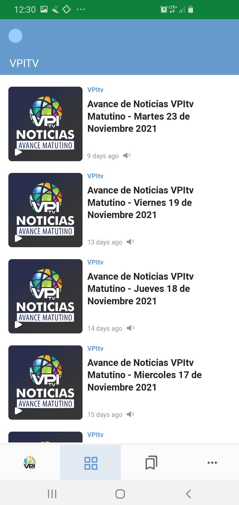

## Summary 

For content publishers, AnyNews is a news distribution suite focused on service to censorship-prone geographies, easily integrated into existing content sources.  AnyNews is open-source and easily branded (or customized, if desired) without extensive effort or expense.  AnyNews integrates technologies to counter a range of censorship regimes and is designed to accommodate new technologies more easily and quickly as they arise. Tools are provided to support a range of publishing options for environments that suffer from connectivity or performance problems. Service engagements are possible when custom software is required.

## Product Concept

Content providers of all types are confronted with a diversity of censorship and network-disruption regimes around the world, with widely-varying political and social forces involved, and manifesting a bewildering array of content access issues to users.  Further, within a given community, independent individuals are impacted by political and social forces in different ways.  In such an environment, it has been a difficult technical struggle to stand up censorship resilient services that provide an easy, understandable user experience while also satisfying the heavy security and privacy demands of the most heavily-impacted users.  New thinking is required to avoid the nightmare scenario of costly and slow application development focused on the most challenging technical demands while, in doing so, alienating many others who give up in frustration and put themselves at risk.  

AnyNews is an open source software project that incorporates a variety of censorship-resistant technologies to mitigate these threats and does so in a way that is responsive to a wider range of use cases.

## Core Capability 

AnyNews is designed for information publication - a one-way, source-to-user interaction - using news feed technologies. The published content can be text, media (imagery, audio, video) or a combination.  Information is typically organized by reverse chronology and/or defined categories.  Most common publication formats are already integrated.  The AnyNews Web Client updates its content regularly without user interaction. Changes to your edition of the AnyNews application occur automatically and immediately upon publication without requiring a special user interaction.

The AnyNews Web Client is a "news reader" type application pre-configured to read a single feed, or a defined set (typically, as offered by a single publisher, with a single publisher's branding). The user experience is clear and straight-forward but offers full-integrated media play and features like saving and sharing.  Internationalization of the application is easily accommodated. 

## Supported Content Formats

AnyNews has built-in support for [RSS 1.0](https://validator.w3.org/feed/docs/rss1.html), [RSS 2.0](https://cyber.harvard.edu/rss/rss.html), and [ATOM 1.0](https://www.tutorialspoint.com/rss/what-is-atom.htm).

Publishers with customized versions of these formats, RDF, NewsML, JSON, XML or later versions of ATOM (such as OData.org's [version](https://www.odata.org/documentation/odata-version-3-0/atom-format/)) can be supported via a service engagement in one of two ways:

- Modification of our deployment/mirroring tools to convert the published format to one of our supported formats (fastest, cheapest approach)

- Modify the AnyNews Web Client to support the custom format (slower, costlier approach better suited to engagements where the Web Client itself is almost being customized) 

## Circumvention in the AnyNews Web Client

The AnyNews Web Client is built using Progressive Web App (PWA) technology.  While on the one hand accessing the AnyNews Web Client feels like accessing a web page in the browser, the AnyNews Web Client is saved to the device’s home screen on first use and, henceforth, acts like a native application.  With this approach, users don't visit their vendor's app store (which might censor your app or be otherwise unaccessible in their country). AnyNews Web Client technology also allows automatic update of the app without app store access or (in the case of Apple/iOS) app store approval.   

Within the AnyNews Web Client itself, censorship or surveillance can be mitigated with optional CDN mirroring.  The Web Client is initially configured to retrieve from one or more mirror sites, each user selecting a mirror randomly on initial startup and then re-trying from the set in random-round-robin style if/when the initial mirror fails.  These hosts can be on different CDN providers and/or in different geographies.  The actual set of mirroring hosts can be changed over time and automatically updated to the AnyNews Web Client.  For some content providers, it is also useful to host the AnyNews Web Client itself on a CDN mirror as well. 

## Serving Marginalized Communities

AnyNews provides tools to pre-process news content for delivery to community-centered hubs at the very edge of the network in places where Internet connectivity for individuals is poor, non-existent or expensive, or under circumstances of natural disaster that make individual connection to the network impossible. These tools can be used to re-publish content to a laptop, tablet or IoT device as small as a Raspberry Pi powered by solar panels and with a highly-intermittent Internet connection. 

## Native Application "Wrappers"

It's possible to produce versions of the AnyNews Web Client *wrapped* in a native (iOS, Android) application layer for delivery to users via the App Stores.  While the App Stores are sometimes subject to censorship, most users are more familiar with this model for acquiring applications and may have a greater sense of trust in applications delivered in that way. 

On Google’s Android, two additional circumvention technologies can be integrated in the native application: 

- Integration with Tor via Guardian Project’s *[Orbot](https://play.google.com/store/apps/details?id=org.torproject.android), Tor for Android*. The AnyNews Android app checks for the presence of Orbot on the user’s device and automatically configures itself to run using Orbot when present.  

- Integration with Clostra's *[NewNode technology](https://www.clostra.com/newnode-mesh-network)*.  NewNode is automatically activated at start-up if Orbot is not present on the device.

As we are working through some operating system limitations, our AnyNews native app for iOS does not offer circumvention technologies beyond the mirroring capabilities in the PWA. 

Our tools for building the native app wrappers are not ready for public consumption at this point, so native wrappers are an optional part of Anynews and available via service engagement.

## Repository

The AnyNews repositories are [HERE](https://gitlab.com/guardianproject/anynews).

## Issue Trackers

- [AnyNews Web Client Issue Tracker](https://gitlab.com/guardianproject/anynews/anynews-web-client/-/issues)
- [AnyNews Republisher Issue Tracker](https://gitlab.com/guardianproject/anynews/AnyNews-Republisher/-/issues)

## License

AnyNews is released under [GNU Public License v3.0](https://www.gnu.org/licenses/gpl-3.0.txt).

## Service Engagement Opportunities

AnyNews is open source.  We’ve documented the steps you’ll need to make AnyNews work with your content and simplify deployment. If you'd prefer help in developing your AnyNews strategy, we can assist.  Engagement types:

- Assistance with Open Source

- Branding-only Engagement

- Deployment Strategy Engagement

- Customization Engagement (customized Web Clients or news source customizations)

- Native App "Wrappers"

- Long-term Deployment Support

## Acknowledgements

Guardian Project thanks the [Open Technology Fund](https://www.opentech.fund/), via it's [Engineering Lab](https://www.opentech.fund/labs/engineering-lab/), for funding the improvements in AnyNews that led to this release. 

