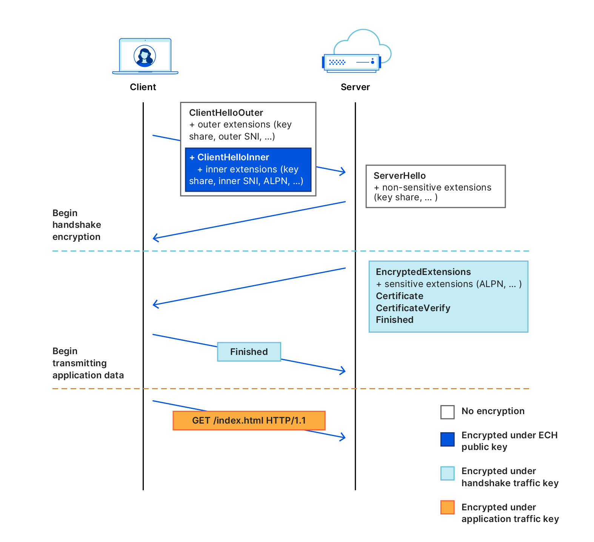

As part of the [DEfO](https://defo.ie/) project, we have been working on
accelerating the development [Encrypted Client Hello
(ECH)](https://www.ietf.org/archive/id/draft-ietf-tls-esni-13.html) as
standardized by the IETF.  ECH is the next step in improving Transport Layer
Security (TLS).  TLS is one of the basic building blocks of the internet, it is
what puts the S in HTTPS.  The ECH standard is nearing completion.  That is
exciting because ECH can encrypt the last plaintext TLS metadata that it is
possible to encrypt.  So ECH will bring some real improvements in privacy and
censorship resistance.

ECH is built on top of TLSv1.3 and [completes unfinished
work](https://blog.cloudflare.com/handshake-encryption-endgame-an-ech-update/)
from the TLSv1.3 effort, now that private DNS is a thing. ECH is now in draft-13
and there are many implementations that are interoperating. ECH is working for
[OpenSSL], [BoringSSL], [nginx], [Apache HTTPD][apache], [lighttpd],
[HAProxy], [Conscrypt], [curl], and more. There is work underway in [Firefox]
and [Chromium]. It has been sketched out for [OkHTTP]. Draft versions of ESNI
and ECH have been deployed in Firefox releases and some production web services.

The main downside of ECH is that it is
[complex](https://defo.ie/report.html#issuesarising), and most of that is
unavoidable.  Large scale websites have complicated server-side setups, and ECH
has to work in those setups.  That is where ECH's complexity comes from.  [DNS
SVCB and HTTPS RR
Types](https://www.ietf.org/archive/id/draft-ietf-dnsop-svcb-https-07.html) is a
related standard to encapsulate the complexity of large scale websites a single
DNS lookup.  It adds additional complexity since it might include the TCP port
number for the service, while TLS implementations mostly assume that the port
number is known before doing a DNS lookup.

ECH was formerly known as Encrypted SNI (ESNI), which it replaces.  So do not
expect updates to ESNI unless ECH proves too complicated for implementers. ECH
is more complex to implement in the TLS library than ESNI.  Once it is
implemented in the TLS library, then implementing the next level of managing the
keys and hostnames is quite similar between ESNI and ECH.  The rest of this post
will be diving into details about that complexity and what it takes to implement
ECH.

## Do Not Stick Out

ECH implementers must also work to ensure that their implementation does not
create packets that look [look
different](https://www.ietf.org/archive/id/draft-ietf-tls-esni-13.html#name-do-not-stick-out)
than other implementations.  How ECH is implemented will affect
fingerprintability.  Right now, BoringSSL, OpenSSL, and Firefox all put the ECH
extension in different places, so it is easy for a network observer to tell
which of them is serving as the client in a TLS session.  Ideally, all
implementations would create network packages that look identical to the network
observer.  To get an idea of this problem in the real world, see [this detailed
technical
discussion](https://gitlab.torproject.org/tpo/anti-censorship/pluggable-transports/snowflake/-/issues/40014)
of metadata ordering in DTLS as used in WebRTC.

## Getting the keys

ECH encrypts the first stage of the negotiation between the client and server,
the _ClientHello_ packet using a new type of key and related configuration.
This is known as an "ECH Config".  This negotiation is what sets up the
encrypted TLS connection, so to encrypt the negotiation, so the keys can not be
derived from the certificates and negotiation itself.  ECH also needs new
methods distributing this ECH Config.  HTTPS/SVCB therefore includes ECH Config Lists,
and DNS is the recommended way to get ECH Config Lists.  Other distribution
methods are also possible, and ECH implementation should provide a method to
directly supply ECH Config Lists.

When using ECH in conjunction with HTTPS/SVCB, the DNS needs to be handled differently
than the common, decades old practices that most TLS stacks are built on.  The
ECH Config List must match the IP address so that multi-CDN setups still work.
That ensures the server gets the ECH Config that matches its ECH private keys,
not the one for a separate server.  If the A/AAAA lookup is done separately from
the HTTPS/SVCB lookup, they might not match since the results could come from
different caches, etc.  It is not yet clear where the right place to handle that
DNS is, but it is clear that clients that implement HTTPS/SVCB and ECH will need to
consider that DNS will touch different parts of the stack.

Which part of the stack will handle the HTTPS/SVCB look up depends on whether
the code is acting as a library or more as the client itself.  For example,
libraries like OkHTTP or Conscrypt can both act as a TLS library, providing the
blocks for implementing TLS in an app.  They can also act as the TLS client
itself, the app just needs to open the hostname and port to get a connection.
This is especially true for OkHTTP, which can also handle DNS itself with its
own DNS-over-HTTPS implementation.  Most apps will expect to just open a URL and
have it work without providing anything else.  In the case of HTTP libraries
like OkHTTP or Volley, Conscrypt becomes the provider of TLS functions rather
than the client.  OkHTTP's default setup will probably want to treat Conscrypt
like the client and do zero config.  But there are use cases where apps want to
handle DNS in OkHTTP, in that case Conscrypt is a library.  Another way this
could be broken down would be to have Conscrypt only be the TLS library, then
leave the DNS to the HTTP stacks.  Then each HTTP library would have to have
their own ECH and HTTPS/SVCB handling (In Android, that would mean
<tt>HttpURLConnection</tt>, OkHTTP, Volley, Apache HTTP Client, etc).  Python
provides another example with HTTP libraries like [Requests] working in
combination with the core [<tt>ssl</tt>][python-ssl] module.

One thing that is clear here: whichever piece initiates the HTTPS/SVCB DNS query
should also handle the ECH Config, and setting up the lower levels.  On top of
this, ECH has GREASE and "Retry Configs".  GREASE is a key part of ensuring that
ECH connections do not stick out.  GREASE makes the network observer see TLS
packets that look the same as connections that successfully used an ECH Config
to encrypt.  Retry Configs are sent by the server if it cannot decrypt what the
client sent.  Whichever piece of the code handles the ECH Config List should
then also handle GREASE and the Retry Configs.

## Outer and Inner _ClientHello_

This post began by saying that ECH was complex.  Most of that complexity stems
from the concept of _ClientHelloOuter_ and _ClientHelloInner_.  They are sort of
parallel versions of the TLS _ClientHello_, with _ClientHelloOuter_ being
plaintext and _ClientHelloInner_ being encrypted.  Many of the same bits of
metadata can be set in either _ClientHelloOuter_ or _ClientHelloInner_, or even
in both.  And the outer and inner values can be different.  For example, the
outer plaintext SNI could be set to a generic domain name, while the inner could
be set to a different domain name that the client wants to protect.  Whenever
the client needs to manage what is set in "inner", "outer", etc., then extra
complexity is exposed all the way up to the app using the ECH client.  Also, so
many possible configuration options also means so many ways that the negotiation
might fail.

BoringSSL's `SSL_set1_ech_config_list()` provides a good example of this complexity:

> If a supported ECHConfig is found, <tt>ssl</tt> will encrypt the true
> ClientHello parameters. If the server cannot decrypt it, e.g. due to a key
> mismatch, ECH has a recovery flow. <tt>ssl</tt> will handshake using the
> cleartext parameters, including a public name in the ECHConfig. If using
> <tt>SSL_CTX_set_custom_verify</tt>, callers should use
> <tt>SSL_get0_ech_name_override</tt> to verify the certificate with the public
> name. If using the built-in verifier, the <tt>X509_STORE_CTX</tt> will be
> configured automatically.
>
> If no other errors are found in this handshake, it will fail with
> <tt>SSL_R_ECH_REJECTED</tt>. Since it didn't use the true parameters, the
> connection cannot be used for application data. Instead, callers should handle
> this error by calling <tt>SSL_get0_ech_retry_configs</tt> and retrying the
> connection with updated ECH parameters. If the retry also fails with
> <tt>SSL_R_ECH_REJECTED</tt>, the caller should report a connection failure.

## A walk through which pieces needs to do what

Let us return to the Python example to go through the pieces needed to implement
ECH there.  Starting at the lowest level, the Python <tt>ssl</tt> is built on
top of OpenSSL, so the new ECH functions in OpenSSL need to be included and
exposed in <tt>ssl</tt>'s API.  Unlike with a plain TLSv1.3 connection,
<tt>ssl</tt> would not set up an ECH connection without additional configuration
as long as <tt>ssl</tt> does not include the additional DNS requirements needed
to fetch the ECH Config.  The DNS could instead be implemented in the HTTP
library.  Requests is built on top of urllib3, so urllib3 could implement
HTTPS/SVCB handling.  Then Requests would automatically get ECH connections.
Since it can be necessary to handle the ECH Config outside of DNS, urllib3 and
Requests could provide methods for the app to submit the ECH Config.  This would
mean overriding any HTTPS/SVCB handling in Requests and urllib3.

Based on this outline, these are the pieces that need to be implemented:

* HTTPS/SVCB DNS queries for getting ECH Config Lists, IP, and other config.
* A way to provide ECH Config Lists as bytes directly to the <tt>ssl</tt> module.
* A method to ensure encrypted DNS is used so all metadata is encrypted.
* A method to enable and disable GREASE, ideally with GREASE default on.
* A callback that gets called whenever ECH negotiation fails and the server
  offers a "Retry Config".
* Potentially also controls of what to send in the _ClientHelloOuter_ versus the
  _ClientHelloInner_.

From the point of view of the client implementation, there is a big difference
between TLS before and after ECH.  This new complexity may look scary but this
is a clear path to providing strong privacy protections with TLS that can be as
widely deployed as TLSv1.3 is now.

[apache]: https://github.com/sftcd/httpd
[BoringSSL]: https://bugs.chromium.org/p/boringssl/issues/detail?id=275
[Chromium]: https://bugs.chromium.org/p/chromium/issues/detail?id=1091403
[conscrypt-issue]: https://github.com/google/conscrypt/issues/730#issuecomment-970234409
[Conscrypt]: https://github.com/guardianproject/conscrypt/tree/2.6.alpha1638179154.job1828169525
[curl]: https://github.com/niallor/curl
[Firefox]: https://bugzilla.mozilla.org/show_bug.cgi?id=1725938
[HAProxy]: https://github.com/sftcd/haproxy/commits/ECH-experimental
[lighttpd]: https://github.com/sftcd/lighttpd1.4
[nginx]: https://github.com/sftcd/nginx
[okhttp]: https://github.com/square/okhttp/issues/6539
[openssl-issue]: https://github.com/openssl/openssl/issues/7482
[OpenSSL]: https://github.com/sftcd/openssl
[python-ssl]: https://bugs.python.org/issue45567
[Requests]: https://github.com/psf/requests/issues/5972
