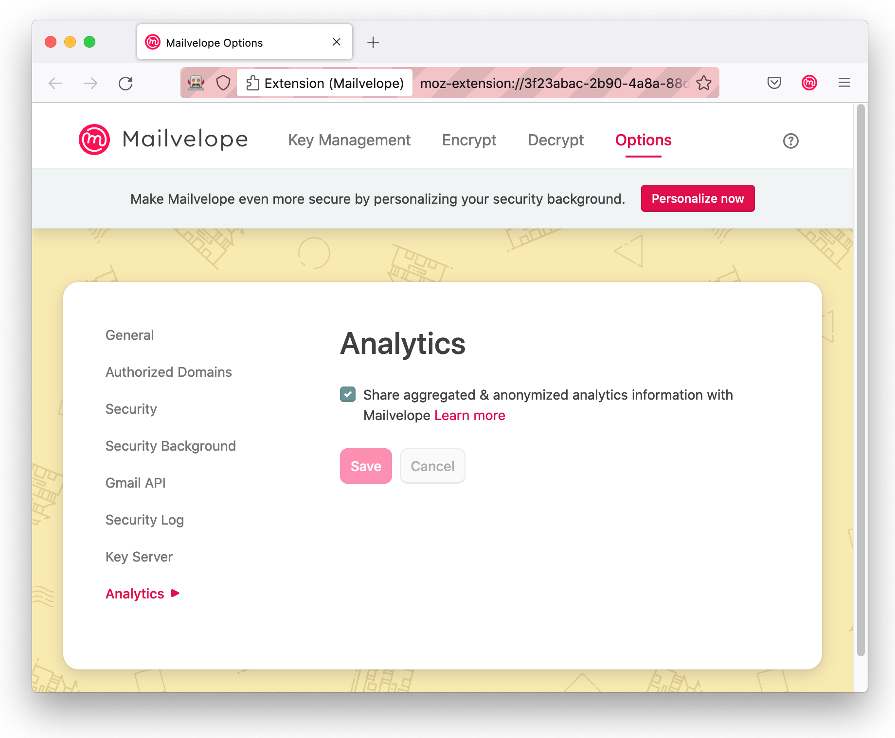

We love [Mailvelope](https://mailvelope.com/). It's a popular browser extension for encrypting email messages. Now, [Clean Insights](https://cleaninsights.org) is helping Mailvelope understand which webmail providers are most popular with their users so they can prioritize their development efforts.

Anyone who has written software knows it takes hard work to craft a great user experience. That's even more challenging in Mailvelope's case. Their browser extension integrates with more than a dozen ever-changing third party webmail interfaces. The Mailvelope team asks itself questions like, "Is time better spent improving the GMail integration or the mailbox.org one?" The answer often hinges on which providers are most popular among Mailvelope users, information not yet readily available to the Mailvelope team. 

So, Mailvelope asked us to set up the [Clean Insights JavaScript SDK](https://gitlab.com/cleaninsights/clean-insights-js-sdk/) to measure which providers are most popular while respecting users' consent and preserving their privacy. In drastic contrast to the web analytics norms, we only collect what we need in order to make important decisions.

We decided we don't care _how many_ visits a user makes in a given week. We just care _that_ a user visited that webmail provider during the week. So that's all we record. We don't record what time of day they visited, how many times, or any information about their identity or who they communicate with. This results in a simple to analyze report from each user like:

* During the week of February 27th, a user visited "mail.google.com" at least once.
* During the week of February 27th, a user visited "*.gmx.net" at least once.
* During the week of March 6th, a user visited "*.gmx.net" at least once.

By adding up the weekly counts from all users, we'll get a handy list of which providers are popular and be able to see changes in that popularity over time.

## Privacy and Anonymity

In addition to Clean Insights' default privacy-preserving features (for example, not storing IP addresses), we configured this measurement campaign to protect Mailvelope users' privacy in some special ways.

Users can use Mailvelope with any webmail provider they like. Some users may be using a personal or corporate mail server at mail.myorganization.com. While knowing how many users used mailbox.org today doesn't implicate any individual, knowing _someone_ visited mail.your-name-here.com wouldn't be nearly so anonymous. So, we set up Mailvelope to only track visits to the short list of default providers Mailvelope supports. When a user uses Mailvelope with a non-default provider, we record that a user used a non-default provider but record neither _who_ nor _which provider_.

You can see how we did it by checking out [the code](https://github.com/mailvelope/mailvelope/pull/788/files) or reading about it on the Mailvelope blog (link to come).

## Consent

We chose to seek user consent right away even though our privacy techniques spare us from GDPR's familiar cookie consent requirement.  We’re spared that because among [other things](https://matomo.org/faq/new-to-piwik/how-do-i-use-matomo-analytics-without-consent-or-cookie-banner/), we don’t use a tracking cookie, we don’t capture personal information, and we don’t track users across sites.  And we chose to ask early, right in the “Let’s Start” dialogue, since the next thing we’ll measure with Clean Insights is “What trips up users during onboarding?”

Being able to withdraw is a critical component of consent, so users can always change their response in a new page we added to Mailvelope's settings menu.

## Next Steps

You may remember we added consent very early in Mailvelope's user journey. That's because the next order of business for us is to analyze what steps users take in their onboarding journey. Particularly, we're interested to discover whether any steps pose a big enough hurdle to new users that they choose to uninstall. More on that to come!

## Using Clean Insights in Your Project

Every software project is different. Just like Mailvelope, you might have a particular question on your mind and specific aspects of user privacy you want to protect. We'd love to help you use [Clean Insights](https://cleaninsights.org) to answer those questions without compromising privacy. If that's interesting to you, you can find us at [support@guardianproject.info](mailto:support@guardianproject.info) or visit the project website at [cleaninsights.org](https://cleaninsights.org).
