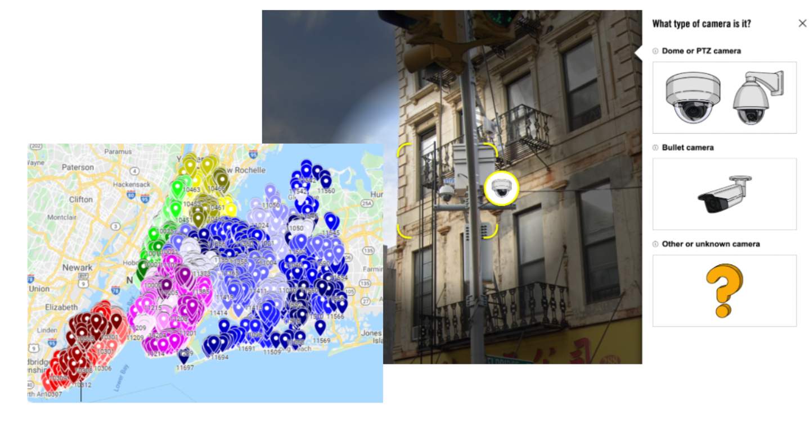

Safety is one of the foremost questions we seek to answer as we roam about in our everyday lives, taking precautions to reduce the likelihood of all threats. It is the very reasoning behind the use of surveillance technology from civilians to the state government, as it hinders crime through fear of persecution and retribution. However, variables such as the time taken for assistance can limit this objective. In these instances, surveillance is not a means of protection, but rather justice, as facial recognition technology can discern the perpetrator to bring to justice. However, the concern arises: do those with the access to this means of seeking justice utilize it for other purposes?    

[RightsCon 2022](https://www.rightscon.org/) offered not just the answer, but further explanation through [‘Surveillance and the city: mapping cameras with facial recognition capabilities in New York City’](https://www.stopspying.org/events/2022/6/6/rightscon-surveillance-and-the-city-mapping-cameras-with-facial-recognition-capabilities-in-new-york-city). NYC was the exemplary location due to its tradition of being a sanctuary to large immigrant communities. So when the NYPD refused to respond favorably to questions regarding how, in which cases, and for what purposes facial recognition is used, Surveillance Technology Oversight Project’s (S.T.O.P.) 2021 Surveillance Census and Amnesty International’s Decode NYC Surveillance initiative answered in its stead. Amnesty and S.T.O.P confirmed that the “map of NYC surveillance cameras strikingly reflects structural racism, segregation, and the oversurveillance and discriminatory policing of BIPOC communities”. Hence, not only is it clear that these technologies are used for means other than justice, it is evident that they are instruments to control minorities and marginalized groups. 

While at first glance this act limits civic space for protest as being able to identify protestors and prosecute as they deem fit, the control seeps deeper. Authorities purposefully display racial biases by invading these populations’ private sanctuary to propagate them as predators who must be watched to keep them at bay, propagating structural inequality to future generations. So even though surveillance offers protection, it can also be used to invade your privacy to be used against you. Compounding this fact with the inaccuracy of facial recognition software, for reasons such as the inability of facial recognition software - testing primarily on white men - to discern between individuals of minority groups, the threat of surveillance’s invasion becomes abundantly clear.  

The United Nations Declaration of Human Rights (UDHR) 1948, Article 12 states that “No one shall be subjected to arbitrary interference with his privacy”. Guardian Project’s intent is to secure the implementation of this declaration by opposing breaches in privacy with services such as ObscuraCam - a secure smart camera that protects privacy by removing all identifying data stored in photos, including the option to pixelate, redact or cover faces to skirt facial recognition. By allowing users to share photos and videos without the fear of data such as their location being shared along with it for misuse, users have the option to secure privacy through novel methods. However, this does not curb the surveillance data and facial recognition from cameras of external parties, only the users’ own photos and videos. And thus, surveillance in itself remains susceptible to exploitation that furthers agendas opposing the public’s welfare. In spite of that, eradication is not the solution as its ability to protect and provide justice remains strong. This renders the question of how surveillance’s purposes can be restricted to those which follow collective society - a question Guardian Project began to answer with ProofMode. 

Recognizing the need to collate and retain data for protection purposes, ProofMode was created to safely store media; ensuring no original files would be tampered with, using cryptography to verify the media and the identities it contains, and offering PGP encryption to protect the content and its metadata. Nonetheless, the aspect of ProofMode that demonstrates how surveillance’s purposes can be restricted to those of protection and justice is the idea it was founded on - capturing data for protection, but encrypting the identities so that the information cannot be used against you, only retrieved and made useful with consent. ProofMode began the conversation into the difference between facial detection and recognition, enforcing the idea that detecting means simply acknowledging a face, and recognition is identifying the person. By opening this discussion, we now can understand that to hinder surveillance from becoming an instrument of control, the identities captured should be protected and encrypted so that only when there is a threat should recognition software be used to solely identify the perpetrator and  ensure the innocent retain their anonymity.   

To further walk this path of opposing the gross misuse of surveillance and facial recognition technology, the next steps should be educating the public on these instruments of control, making them aware of the systems in palace that assist in retaining anonymity, and inviting them to the aforementioned discussion. In conjunction, a goal for Guardian Project should be integrating the publicly available maps of surveillance for ease of access and use into ObscuraCam. These maps offer two distinct functions for users with one common goal that aligns with ObscuraCam’s mission - self-protection; foremost, it protects users from external threats by offering a watchful eye, the original intended goal; secondly, it assists users against the watchful eye by skirting surveillance that can be used against them in acts of defiance such as protests. The third functionality is one that benefits not just individual users, but society at large - advancing knowledge of structural inequality. Increasing awareness of the areas of clustered surveillance escalates knowledge of the presence and level of the structural inequality to amass support against such. With greater awareness, the suveillant’s power diminishes as people have the ability to take back their privacy, rendering the project obsolete until the objective is re-routed inline with the mass. To do so, transparency and awareness through discussion are what we must strive to achieve, ensuring surveillance and facial recognition be used only for protection and not as an instrument of control. 

