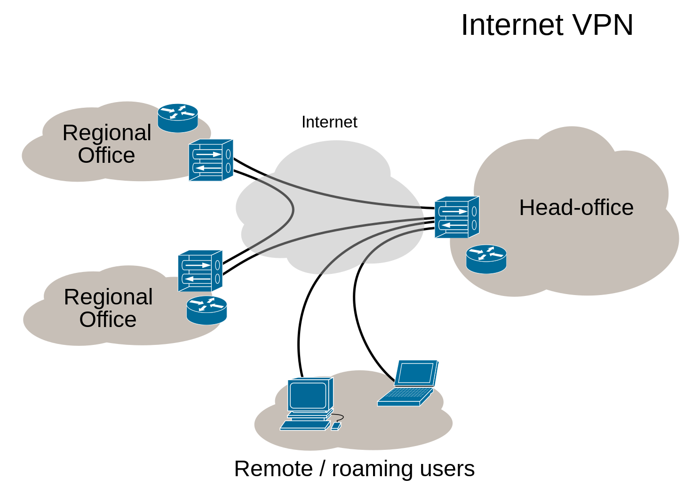

VPNs have become quite popular in recent years for a number of reasons, and more and more they are being touted as a privacy tool.  The question is whether using a VPN does improve privacy.  It is clear that VPNs are quite useful for getting access to things on the internet when direct connections are blocked.  VPN providers include a number of tactics in both their client apps and server infrastructure to ensure that their users are able to make a connection.  Then once users are connected, all of their traffic that goes over the VPN will see the internet from the point of view of the VPN's server.  That is how VPNs "unblock" the internet.  In contrast, some are using VPNs to selectively block things, like making a system-wide [adblocker](https://www.digitalocean.com/community/tutorials/how-to-block-advertisements-at-the-dns-level-using-pi-hole-and-openvpn-on-ubuntu-16-04).

To answer the question about whether they are a useful privacy tool, let's start with the history of where VPNs came from.  VPN stands for Virtual Private Network.  They were developed by large companies with multiple offices and travelling employees.  The goal was to link together all of these offices so that internal data could be freely shared between them without that data going over the internet as easily readable unencrypted plain text.  Then travelling employees could also safely access the internal data via any internet connection.  The key piece of this picture is that the users, employees in this case, already had to trust their VPN provider.  The VPN provider was the company they worked for, and the data they were handling belonged to the company.  So there was no attempt to hide user information from the VPN provider.  Indeed quite the opposite: companies linked the VPN access to each employee's "single sign-on" account.  Built into the design of VPNs is full trust of the VPN provider, with the aim of keeping the data private from the internet. This setup was also by design, since many large companies wanted to ensure their employees work laptops were still going through the corporate firewall, where the company could block certain sites (e.g. malware, porn), then also [monitor employees](https://www.fortinet.com/resources/cyberglossary/data-exfiltration) internet activity to ensure they are not exposing files that the company does not want to be public.

This does not paint a good picture for a tool to protect privacy.  But there is hope!  It is possible to use a VPN to improve your privacy if you pay attention to some key details.  For VPN services to provide privacy, you have to put a lot of trust in the people who are operating the service.  The VPN provider can see **all** of your traffic that goes over the VPN, and they have a strong link to your user account with them.  The privacy advantage of a VPN is that the destination sites cannot see which IP address your device is coming from, they will see the VPN provider's IP address.  And your ISP will see you are using a VPN, but not which sites you visit.  With HTTPS, TLS, and end-to-end encryption being widespread, any encrypted content will be protected from the VPN provider also.  But the VPN provider can still see where you are connecting from, which sites and services you are using, what time of day, and even potentially correlate traffic to link activities of their users.  In other words, the VPN operator sees lots of metadata about you, so much so that they could paint a quite detailed portrait of your personal life if they ever did let their data be analyzed.

## How to build a privacy-respecting VPN service

There are good signals that VPN services can send to show that they are tackling the real issues.  For example, shipping free software clients, maintaining a [warrant canary](https://www.eff.org/deeplinks/2016/05/canary-watch-one-year-later), posting a clear privacy policy describing the logging policy, and publishing the unredacted results of third party audits.  If the VPN operator is doing the right thing, then VPNs can provide a relatively private way to access the internet.  With a consistent track record of transparency, they can build up a trusted reputation for protecting privacy.  Unfortunately, we cannot rest there since a VPN provider can change their setup quite easily, whether willingly or under duress.  Maintaining consistent, regular, and transparent communications is therefore essential.

* Calyx Institute's [Privacy Policy](https://calyxinstitute.org/legal/privacy-policy)
 and [Financials and Annual Reports](https://calyxinstitute.org/about/financials-and-annual-reports)
* Mozilla's [Data Privacy Principles](https://www.mozilla.org/en-US/privacy/principles/)
* Mullvad's [Swedish legislation relevant to us as a VPN provider](https://mullvad.net/help/swedish-legislation/) and [Privacy Policy](https://mullvad.net/help/no-logging-data-policy/)

On top of that, the [VPNalyzer](https://vpnalyzer.org/) project is working to make monitoring VPN services a lot easier and possible to crowdsource.  This gives a third party perspective from some respected organizations.

### Know as little as possible about your users

Many VPN providers require an account and payment information.  This is usually personally identifiable information, like name, credit card information, email address, phone number, billing address, etc.  The most private services have [no user accounts by design](https://f-droid.org/2022/02/28/no-user-accounts-by-design.html).  Calyx, Lavabit, and Riseup VPNs do not require any account or payment at all, so they do not have that information to give out or leak.  Providers that accept payment need a way to tie payment to service, that is usually done using accounts tied to email addresses or phone numbers.  Personal details are not required to make accounts and payments work.  Mullvad uses a randomly generated account number only, there is no link to other identifiers unless you provide them.  Additionally, Mullvad is one of the few VPN vendors that accepts cash payments.  Many technically minded implementers laugh at the idea of processing envelopes of cash, but it is an effective, real world solution to minimizing personal data that software methods struggle to match.

### Keep as little information as possible

The VPN servers unavoidably see lots of information about what users are doing.  The default with most servers is to keep logs of that data. The longer this data is kept, the greater the risk it will be used to identify users and their activities. It does not help that standard practice for running servers is to keep logs for a long time.  Many service providers keep those logs for years.

VPN providers must be clear about what logs they are keeping, and how long they are stored.  Even better, they will provide information about how they do store the data that they do keep.  For example, if the servers do not use full disk encryption, then it would be straightforward to recover the deleted logs.  That is much harder on systems using full disk encryption.

* A [2019 audit](https://cure53.de/audit-report_ivpn.pdf) of [IVPN](https://www.ivpn.net/blog/independent-security-audit-concluded) showed that, at that time, the auditors confirmed that IVPN performed no "statistical logging of customer-traffic", "logging of traffic, IP addresses or DNS requests" on the servers that the auditors were given access to.
* Mullvad says, "we never store any activity logs of any kind." in their [no logging data policy](https://mullvad.net/en/help/no-logging-data-policy/)

### Proven track record of resisting unjust legal intrusion

There are many legal ways for authorities to get private data, this is an essential part of a functioning justice system.  But these powers are sadly abused in basically every country in the world, it is only a question of degrees.  A VPN provider needs to represent its users legal interests, and push back on legal orders when there is the possibility they are unjust.  Calyx Institute's Nick Merrill provides the shining example in this regard.  With the ACLU, he fought a [legal case](https://en.wikipedia.org/wiki/Doe_v._Ashcroft) for over a decade to prevent unjust intrusion for his users.  Ladar Levison shut down his email company [Lavabit](https://en.wikipedia.org/wiki/Lavabit) rather than allow the US Government to monitor Edward Snowden's email account.

There are other ways to ensure that the legal processes are not abused.  These include warrant canaries and disclosure when data had to be turned over via legal procedures.

* Mozilla's [Transparency](https://www.mozilla.org/en-US/about/policy/transparency/) policy
* ProtonVPN's [Transparency Report & Warrant Canary](https://protonvpn.com/blog/transparency-report/)
* Riseup's [Canary Statement](https://riseup.net/canary)

### Publish as much as possible as free open source software

F-Droid works to build [services](https://f-droid.org/2022/05/24/buildserver-overhaul-sponsored-by-calyx-institute.html) where free software, [code](https://f-droid.org/2022/07/22/maven-central.html) [inspection](https://f-droid.org/2022/09/30/free-software-and-inspection-are-key-to-software-we-can-trust.html), [reproducible builds](https://f-droid.org/2023/01/15/towards-a-reproducible-fdroid.html) provide a method to ensure that the software we deliver is trustworthy.  VPN vendors recognize how important trust is, so the good ones work to get their apps into f-droid.org.  The F-Droid community provides the best screening for ensuring Android apps are truly free software.  On top of that, F-Droid flags apps for [Anti-Features](https://f-droid.org/docs/Anti-Features/), which are things that users may not like, but might accept.  Here are VPN clients that do maintain their free software clients in f-droid.org:

* [Bitmask](https://f-droid.org/packages/se.leap.bitmaskclient/)
* [Calyx VPN](https://f-droid.org/packages/org.calyxinstitute.vpn/)
* [eduVPN](https://f-droid.org/packages/nl.eduvpn.app/)
* [IVPN](https://f-droid.org/packages/net.ivpn.client/)
* [Lavabit Encrypted Proxy](https://f-droid.org/packages/com.lavabit.pahoehoe/)
* [Mullvad VPN](https://f-droid.org/packages/net.mullvad.mullvadvpn/)
* [Outline](https://f-droid.org/packages/org.outline.android.client/)
* [ProtonVPN](https://f-droid.org/packages/ch.protonvpn.android/)
* [Purism Librem Tunnel](https://f-droid.org/packages/one.librem.tunnel/)
* [Riseup VPN](https://f-droid.org/packages/se.leap.riseupvpn/)
* [Tailscale](https://f-droid.org/packages/com.tailscale.ipn/)
* [WireGuard](https://f-droid.org/packages/com.wireguard.android/)

### Use external auditors to confirm source code and operations

External auditors are important because they can bring fresh eyes on the source code, and good auditors are experts at finding issues in source code and server setups.  And responsible organizations will publish the full, unredacted audit report once they have fixed the issues.  Even if a VPN app is included in F-Droid, there are key aspects of the service that cannot be independently verified.  For this, we must rely on the people who run the service to do the right thing.  Audits can demonstrate that they were doing the right thing at the point of time of the audit.  Here are some examples:

* IVPN's [2019 audit of IVPN](https://cure53.de/audit-report_ivpn.pdf)
* Mozilla VPN had their app source code [audited](https://blog.mozilla.org/security/files/2021/08/FVP-02-report.final_.pdf) in 2021 and fixed the issues that were found.
* Mullvad's [Pentest-Report Mullvad Apps, Clients & API 05.2020](https://cure53.de/pentest-report_mullvad_2020_v2.pdf), [Pentest-Report Mullvad VPN Clients 09.2018](https://cure53.de/pentest-report_mullvad_v2.pdf), and [2020 Infrastructure Audit](https://mullvad.net/en/blog/2021/1/20/no-pii-or-privacy-leaks-found-cure53s-infrastructure-audit/)
* Outline's [2017 Pentratration Test Report](https://s3.amazonaws.com/outline-vpn/static_downloads/ros-report.pdf) and [Pentest & Audit Report Jigsaw Outline 09.-12.2018](https://s3.amazonaws.com/outline-vpn/static_downloads/cure53-report.pdf)
* Proton VPN open sourced their client apps and had them [audited](https://www.zdnet.com/article/protonvpn-apps-handed-to-open-source-community-in-transparency-security-push/) in 2019.

### Publicly verifiable binaries via reproducible builds

Source code is the easiest place to conduct an audit of software, but it is the binary files that actually run on your device.  Auditing binaries rarely happens since it is so much more time intensive.  And yet, there are ways to change how software works without changing the source code. This can be done by injecting changes into the process that converts the source code into the executable binary.  [Reproducible Builds](https://reproducible-builds.org/) is the indisputable method for proving that a given binary was generated by given source code.

There are some generic VPN clients in Debian that are built reproducibly, but there are no Android or iOS VPN apps or  branded desktop client apps that meet this standard yet.  We recommend that VPN providers work with [Debian](https://wiki.debian.org/ReproducibleBuilds), [F-Droid](f-droid.org/docs/Reproducible_Builds), the [Reproducible Builds](https://reproducible-builds.org/) group, or any other relevant [project](https://reproducible-builds.org/who/projects/) to achieve this key step.

### Apple iOS

This post focuses on Android because iOS has a number of issues that make using VPNs for privacy less effective.  For example, VPNs on iOS will [leak IP addresses](https://www.bleepingcomputer.com/news/security/unpatched-ios-bug-blocks-vpns-from-encrypting-all-traffic/).  Apple knows about this issue, yet still has [not fixed](https://www.theregister.com/2022/08/19/apple_ios_vpn/) it after a couple years.  On top of that, it is not possible to have reproducible builds on iOS because the actual executable binaries are encrypted by Apple's proprietary Digital Restrictions Management (DRM), so only Apple could ever reproducibly build something.  If you are running Apple iOS, you are stuck trusting Apple to do the right thing, since they operate a relatively opaque, proprietary, strictly walled garden.

## Run your own VPN

The VPN security model means you have to put a ton of trust in the operator.  Questions of trust get much easier when you are talking about yourself or own organization.  There are many projects that aim to make it as easy as possible to run your own VPN service.  The good ones are all free software and have been audited, both the client source code and the server side setup.

* [Amnezia](https://amnezia.org) is a free service to create a personal VPN on your server.
* [LEAP VPN](https://leap.se/) is a "white label" VPN setup used to build Bitmask, CalyxVPN, RiseupVPN and more.
* [Outline](https://getoutline.org/) "makes it easy to create a VPN server, giving anyone access to the free and open internet."
* [WEPN](https://we-pn.com/) is a free software kit to become your own VPN provider, designed around a small hardware device.

There are also generic VPN client apps based on standard protocols:

* [eduVPN](https://f-droid.org/packages/nl.eduvpn.app/)
* [OpenVPN for Android](https://f-droid.org/packages/de.blinkt.openvpn/)
* [Shadowsocks](https://f-droid.org/en/packages/com.github.shadowsocks/)
* [strongSwan](https://f-droid.org/packages/org.strongswan.android/)
* [WireGuard](https://f-droid.org/packages/com.WireGuard.android/)

## Comparing VPNs to Tor and MASQUE

If it is privacy that you seek, then there are other tools to review.  Tor is a longstanding community project that aims to make privacy proxies without compromise. Tor works similarly to VPN in that it is tunneling traffic to shared servers, the big difference is that your traffic is tunneled through three relays (in comparison to single hop VPNs). Each individual Tor relay cannot see the enough to put together a picture of who is doing what. At most, a relay can see what is done, but not who.  Or that someone is accessing Tor, but not their destination.  [Orbot](https://guardianproject.info/apps/org.torproject.android/) provides a VPN mode, but this is still full Tor protection, since it is just using the device's VPN user experience to provide access to the Tor network.  [Tor Browser](https://www.torproject.org/) then adds whole other layers of privacy protection that can only be implemented in the internet-enabled app.  This includes things like reducing metadata leaks in the HTTPS connection or web APIs, or isolating websites from each other within the browser, so they cannot read data about other sites the user has visited.

A new approach that is somewhere in between a VPN and Tor are multi-hop [MASQUE](https://guardianproject.info/2020/02/25/masque-review/) relays.  MASQUE is a new protocol that is similar to VPN and proxy protocols.  MASQUE is built on HTTP/3 aka QUIC, so it does not stick out as much as VPN or WireGuard traffic.  It also allows for multi-hop configurations.  MASQUE is only newly deployed, so there is not the two decades of experience working to minimize metadata leaks in the processes for relaying traffic.

Apple iCloud Private Relay is a [two hop deployment](https://blog.cloudflare.com/icloud-private-relay/) on MASQUE, which means that the Apple side can see that the user is sending traffic, and the Cloudflare side can see the destination, but not the user.  That does provide a real privacy improvement over a single hop system.  Unfortunately, Apple iCloud Private Relay fails most of the other tests laid out in this post.  Plus given the history of NSA programs like PRISM, and the willingness for US companies like Apple and Google to [take part](https://www.theguardian.com/world/2013/jun/06/us-tech-giants-nsa-data), this setup is not clear protection from NSA and Five Eyes surveillance and targeting.  It would be relatively straightforward for those kinds of agencies to correlate the data from the Apple and Cloudflare side if they have access to the metadata from both sides.

If privacy is your primary concern, then it is worth investing time into tools like Tor.  If you have limited time and are mostly concerned about mass surveillance, then a good VPN is worth considering for some added privacy protection.
