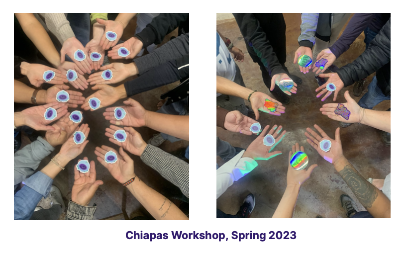
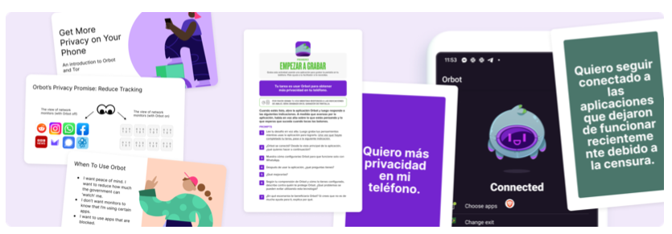

Between 2022 and 2023 Guardian Project, with support from [Okthanks](https://okthanks.com) and the [Tor Project](https://torproject.org), organized and participated in a total of 12 workshops in Ecuador, Mexico and Brazil with the participation of 161 people. The workshops focused both on the broad topic of “Tor for Smartphones”, while also taking deeper dives into specific topics like virtual private networks VPNs) and anonymous web browsing. Through a variety of methods, we gathered feedback from the participants in each of those sessions. We also ran detailed individual tests with volunteers to collect insights related to new features and usability improvements on specific apps.
Our top takeaways from this process were, as follows:

- **Changing Misconceptions of Performance** A positive outcome of each workshop was the opportunity to show participants how much has the Tor network speed improved and address misconceptions related to downloading files and watching videos, one of the main reasons why users stopped using Tor in the past.
- **Ease of Onboarding Matters** When working with at-risk individuals, it’s important for the first experience to be easy and straightforward.
- **Support Flexible Use** People’s behaviors around using VPNs tend to vary. Many will use it in certain situations. They are not running it all of the time for everything, but only when they need it.
- **Consider Physical Security** One of the high-level threats we identified during the workshops we ran was the existence of physical check-points run by drug cartels in the south of Mexico. People entering or leaving an area are asked either to provide access to their phones for review or leave them at the checkpoint until they leave the area. It is not clear what they are looking for when they get access to a device, but in many cases, people who left their devices at the checkpoint do not return to claim them out of fear. For this reason, we encourage the use of app icon camouflage features on privacy and security focused apps.
- **Awareness and Education** The primary reason people in Latin America have been slow to adopt Tor tools is not that they do not work in their context, but due to awareness they exist. They have a hard time understanding what they do and how they work, and have many misconceptions about them. Continued outreach and education about which tools to use when is needed to increase adoption.

**We are proud to share this 20 page report on our usability focused work on Tor in Latin America**
Thank you to everyone who made this work possible, from our partners at Tor Project, our community partners, funders, designers, developers, and other supporters. Without all of you, we would not be able to do this important work to broaden the reach and effectiveness of privacy-enhancing tools in Latin America.

[Download the full report PDF here.](GuardianProject-TorUsabilityOnSmartphonesLatinAmerica-May2023-v0.0.2.pdf)
