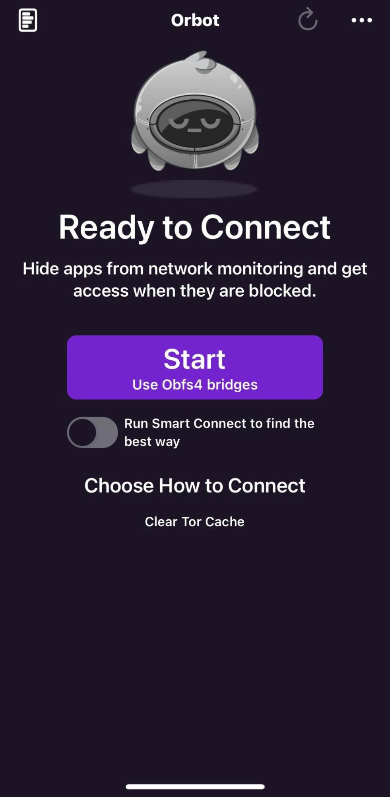
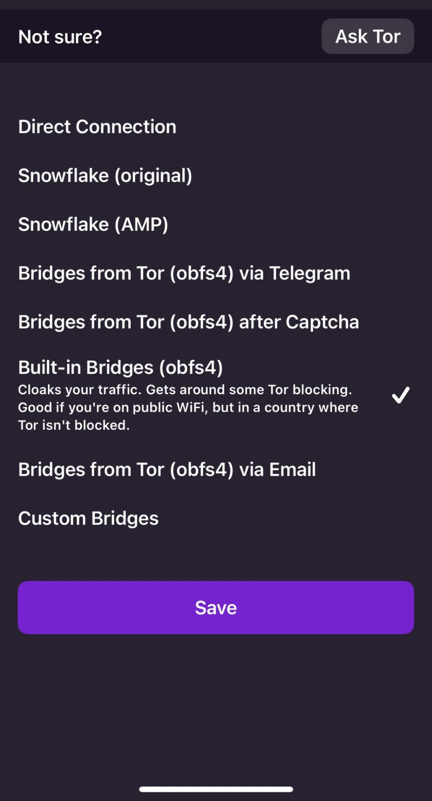
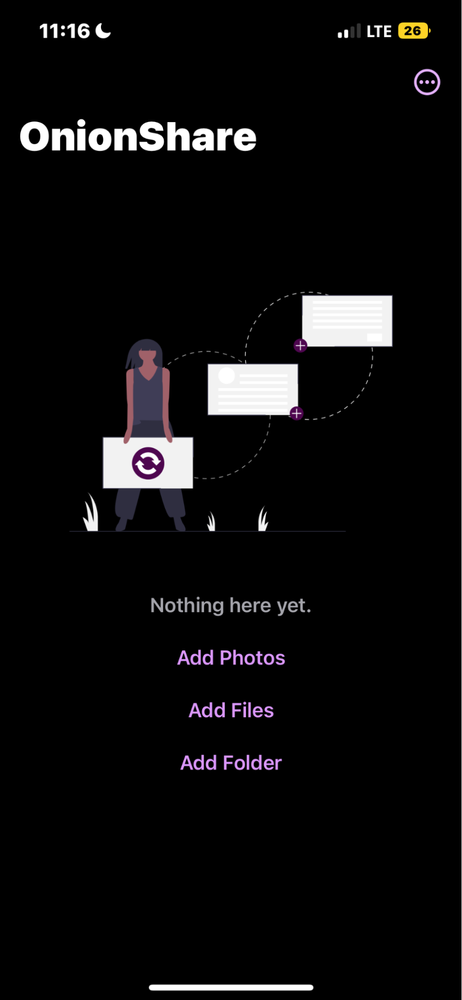
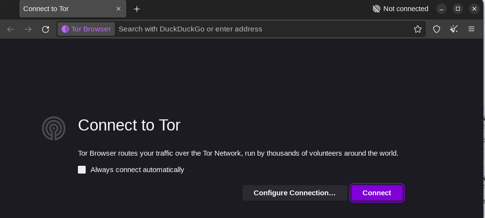
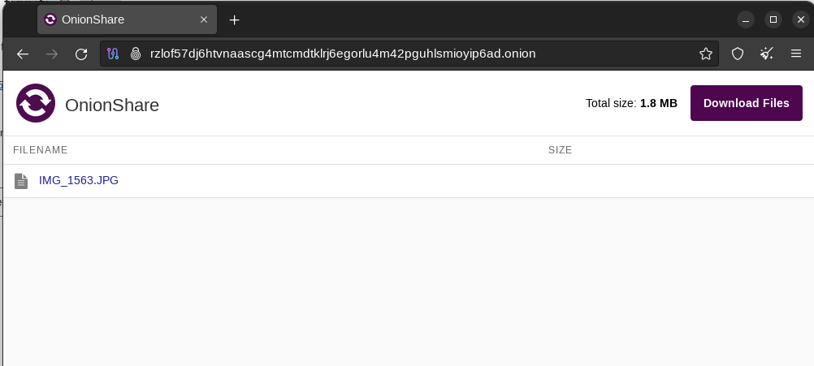

*Our summer intern Alfred just graduated high-school and is preparing to attend a major university to focus on a technical degree. He has a personal interest in privacy and security, and is working with us on a variety of projects this summer as part of a broad, crash-course in all things Guardian Project!*

Last week, I worked with three different apps for the iPhone that, when they work together, allow for a secure and private mobile internet experience. Since they all build on the Tor Network, they also offer an untraceable way to share and download media. My task was to test the user experience in these apps and see how they interact with each other and to make sure that they’re working in the intended ways following a test plan. 

The first app Orbot, which acts as a secure vpn is the core of the security. It makes it very difficult to track the user when browsing. The first thing you want to do before you start browsing is to open the Orbot app and complete the setup with the vpn configuration. 

Once set up you could press start to use the default vpn or if you’d need more security you would click the ‘Choose how to Connect’ option below that and it’ll take you to a page where you can connect to an even more secure network because Orbot provides you with a network proxy. Choosing other options provides you with even more proxies making your ip or your browsing harder to detect or track. 

Now that you’ve activated the Orbot vpn you can access the Onion Browser where you can freely browse as if you were using your regular browsing app like Chrome or Safari but now with even more security and privacy.

Then, I continued my testing with the Onion Share mobile app. This app allows you to freely and securely share media using a secure “.onion” download link, that can be opened by anyone with Onion Browser or Tor Browser.

As you can see in the interface you can choose to send photos, files, or even whole folders to share media in. OnionShare then creates a link that can only be accessed through using any Tor-enabled web browser, such as Onion Browser or Tor Browser. You can then download the files and view them as normal. 

This is the screen you’re greeted with when launching Tor Browser on the desktop. As you can see the interface resembles that of a normal browser. When connected to the Tor now, you’re able to open up links from OnionShare which can’t be opened anywhere else.

This is what the OnionShare screen on the desktop looks like using the Tor Browser. From here you can select to download the files and view them. 

I think it's interesting and very helpful how the usage of the combination of these apps not only provides you a secure browsing experience but also allows you to share different forms of media while also making it incredibly difficult to trace and track.

You can download the Orbot+Onion Browser+OnionShare for iOS QA Test Plan that was used to guide this work here: [Download Test Plan](https://github.com/guardianproject/orbot-apple/blob/main/testing/OrbotOnionBrowserOnionShareiOS-TestPlan-July2023.xlsx)

