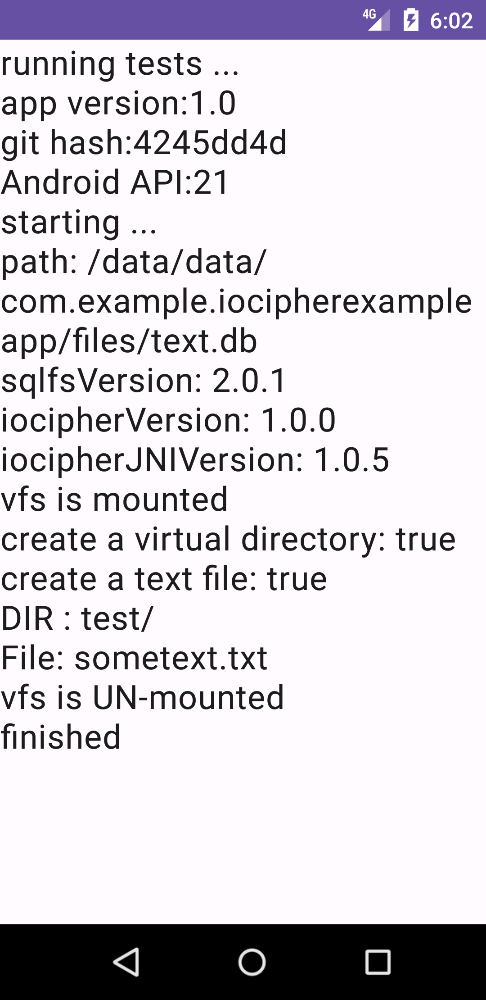

## IOCipher update to version 1.0

We are thrilled to announce that a community contributor has picked up maintaining a fork of IOCipher and updated to IOCipher 1.0,
designed to enhance your development experience and empower you to create more secure applications with ease. Here’s what’s new and why it matters to you:

### 1. Enhanced Features
We introduced a few new features. Most notably IOCipher is also available on Desktop Java for Linux and Windows now. (Although not all IOCipher features are fully supported on Windows).
The latest release even includes some example code for accessing IOCipher VFS using Python.

### 2. Dependency updates
We updated to the newest SQLCipher and OpenSSL.

### 3. Bug Fixes and Stability
Now your virtual files can be as large as you want, there is no longer a hard limit at 4 GB.
We fixed some bugs that testing the JNI code with ASAN has found.

## IOCipher: Encrypted Virtual Disk (for Android and Linux JVM)

IOCipher is a virtual encrypted disk for apps without requiring the device to be rooted. It uses a clone of the standard java.io API for working with files. Just password handling & opening the virtual disk are what stand between developers and fully encrypted file storage. It is based on libsqlfs and SQLCipher.

IOCipher is based on transactions in SQLite, which means that it does not require being mounted in the normal sense. There is no open state once a transaction is complete. Each read or write operation is a self-contained SQLite transaction, so if the file system is forcably quit, SQLite’s transactions prevent the whole file system from being corrupted. This is important in Android since an Activity or Service can be killed at any moment without warning.

## Features
  * Comes with **all batteries included**
  * Secure transparent app-level **virtual encrypted disk**
  * Multi-threaded access
  * **No root** required
  * Only **three new methods** to learn: `VirtualFileSystem.get()`, `VirtualFileSystem.mount(dbFile, password)`, and `VirtualFileSystem.unmount()`
  * Supports Android API 21 and above
  * Supports Java version 8 and above on Desktop

## Adding IOCipher to your App

Here's a minimal example for using IOCipher to encrypt all files your app is storing on a phone:

  * add to your project build.gradle
<pre>
allprojects {
    repositories {
        google()
        mavenCentral()
        maven {
            url "https://jitpack.io"
        }
    }
}
</pre>
  * add to your module build.gradle
<pre>
implementation 'com.github.zoff99:pkgs_guardianprojectIOCipher:1.0.5'
</pre>
  * get the VFS singleton using `VirtualFileSystem.get()`
  * on first run, create the container file with a password using `VirtualFileSystem.createNewContainer(dbFile, password)`
  * mount the container file with a password using `VirtualFileSystem.mount(dbFile, password)`
  * replace the relevant `java.io` import statements with `info.guardianproject.iocipher`
<pre>
import info.guardianproject.iocipher.File;
import info.guardianproject.iocipher.FileOutputStream;
import info.guardianproject.iocipher.FileReader;
import info.guardianproject.iocipher.IOCipherFileChannel;
import info.guardianproject.iocipher.VirtualFileSystem;
import java.io.FileNotFoundException;
import java.io.IOException;
import java.io.InputStream;
import java.nio.channels.Channels;
import java.nio.channels.ReadableByteChannel;
</pre>

For a full Android example project see: <https://github.com/zoff99/iocipher_pack/tree/master/007_example_android>

## Source Code

  * all you need for your project: <https://github.com/zoff99/iocipher_pack>

### optional:

  * a simple test app for Android: <https://github.com/zoff99/iocipher_pack/tree/master/007_example_android>
  * a simple example desktop file manager app: <https://github.com/zoff99/iocipher_pack/tree/master/004_example_jvm>
  * a simple python example for Linux: <https://github.com/zoff99/iocipher_pack/tree/master/006_example_python>
  * a simple C API example for Linux: <https://github.com/zoff99/iocipher_pack/tree/master/005_example_c>
  * a simple C API example for Windows: <https://github.com/zoff99/iocipher_pack/tree/master/005_example_c_win64>
  * the core: <https://github.com/zoff99/iocipher_pack/tree/master/002_src_libsqlfs>

## Usage notes

  * only one active mount per-app is supported

